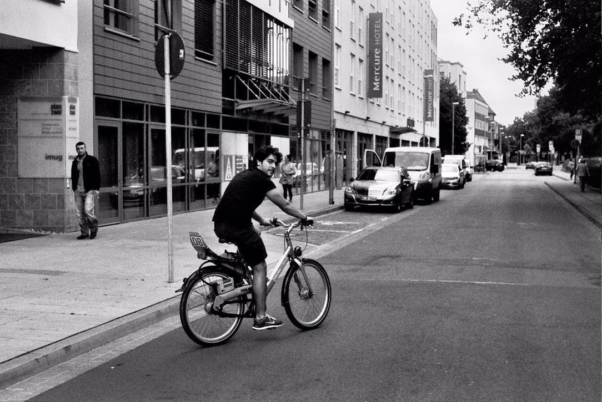
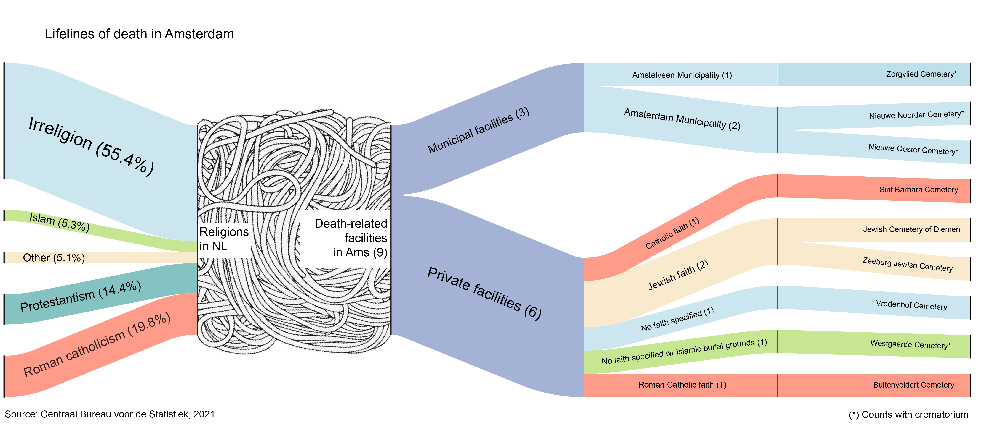
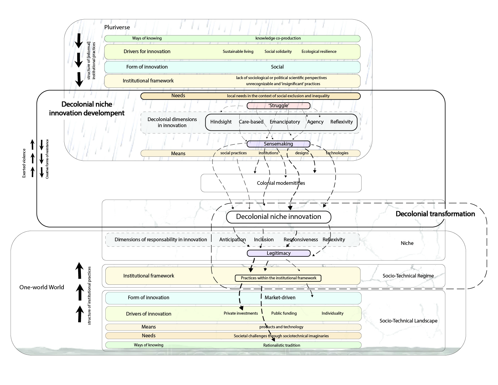
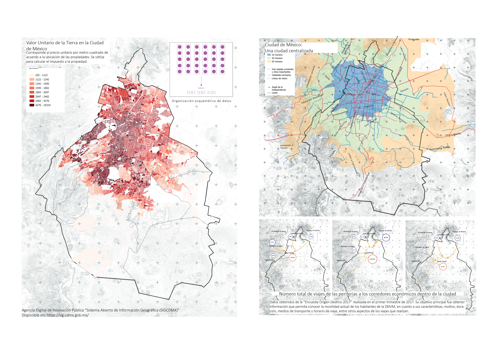
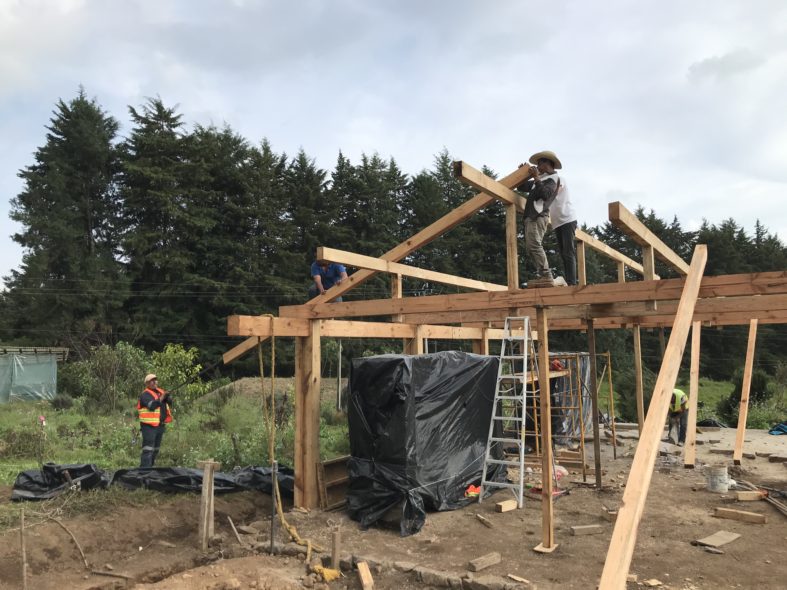
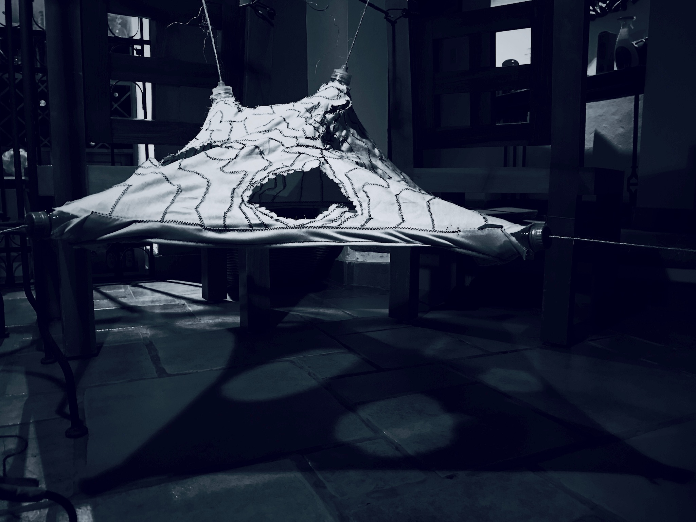

## About me

> _I like to call myself an **urban innovator**, **designer** and **researcher** because of my multidisciplinary approach to tackling complex challenges in cities. With an MSc in Metropolitan Analysis, Design, and Engineering—a joint program by TU Delft and Wageningen University & Research—I integrate **theory**, **design experimentation**, and **real-world applications**, bridging abstract concepts with practical, impactful solutions._

> _My work is driven by a deep sensitivity to **cultural narratives**, **human experiences**, and **systemic inequalities**, fostering a commitment to rethinking spatial practices, challenging colonial legacies, and envisioning **more inclusive futures in design and urbanism**. Through research-driven innovation and multicultural collaboration, I strive to translate complex systems thinking into actionable urban strategies that support sustainable environmental and societal change._

> 

##### Reach out through [Linkedin](https://www.linkedin.com/in/juan-jose-corona/) or, if you want to learn about one of my hobbies, click [here](https://www.instagram.com/jjclucio).

---

# Multidisciplinary Collaborations

### [Clean Inner City Living Lab](page-1.md)

The research highlights the gaps between the design of the waste management system and its real-world application, particularly in how waste is perceived and managed in the area. Using a socio-technical systems framework, the misalignments between social behaviors, technical infrastructure, and waste management processes are identified.

> 

### [UnmuteCommute](page6.md)

Unmute Commute is an entrepreneurial venture that rethinks public transit as a social space, fostering connections between commuters through a data-driven, user-centric product. The initiative combines physical tokens (bracelets, badges, or keychains) with a digital engagement platform, providing commuters with a low-effort, opt-in method to signal their openness to conversation.

>   

---

# Urban Research Projects

### [The Ex[cease]tance](page2.md)

The Exceasetance engages with the logistics of burial and its embedded power structures, critically examinining Western funerary practices through a Mexican cultural lens.
It envisions new discourses of designing alternative spatial strategies for death and remembrance beyond colonial narratives.

> 

### [Raindrops of Change](page3.md)

Decolonial Niche Innovations seeks to challenge the dominant paradigms of infrastructure and technological development by centering non-Western knowledge systems.
Through this lens, it explores alternative design methodologies that resist extractivist and capitalist models, offering a roadmap for decolonial futures.

> 

### [Post-Covid19 Urban Dynamics in Mexico City | (1/2)](page4.md)

Acknowledging the oversupply of office spaces in the city and the financial inaccessibility of acquiring permanent housing, this research explores an alternative model of temporary urban living tailored for young professionals. 

> 

### [Follow-up Research: CLJT Housing Typology | (2/2)](page5.md)

By providing an accessible first step toward independent living, the researched housing model represents a progressive urban housing strategy—one that rethinks inclusion, affordability, and social mobility in one of the world's most dynamic metropolitan centers.

### [MEXICO CITY: Twelve archeologies of housing at a crossroads](page7.md)

The research focuses on analyzing and understanding collective housing models and how shared spaces within these models can serve as tools for social change. It questions the traditional model of private property and the nuclear family, arguing that these structures perpetuate inequalities and limit the possibilities for socialization and the collectivization of domestic and reproductive labor.

> 

---

# Research & Design Projects

### [Wood Prototyping, Fabrication, & Community Engagement](page8.md)

Conceiving the use of wood, through forest use and maintenance, as an alternative material for construction, the present research and design project seeks to establish a closer dialogue between unskilled labor, the architect and digital design

> 

### [Tensegrity Pavilion – Digital Prototyping & Experimental Research](page9.md)

The research unfolded through a non-linear iterative process, seamlessly integrating digital experimentation with the creation of physical prototypes. This dynamic approach fostered a deeper understanding of the design's behavior and material properties, allowing for constant feedback and refinement.

>  

### [Codified Reinterpretation](page10.md)

From a reinterpretation of the creative process and the work of the North American artist Chuck Close, the geometric bases on which his discourse is built were abstracted and translated into the Python programming language. 

---

# Others

### [Foro/ENTRE/2020](https://issuu.com/escuadraarquitectura/docs/foro_entre_book)

### [ECO-TEQUIO Volunteer Experience](page11.md)
---

_Thanks for stopping by! I'm always open to new ideas, and good conversations_
