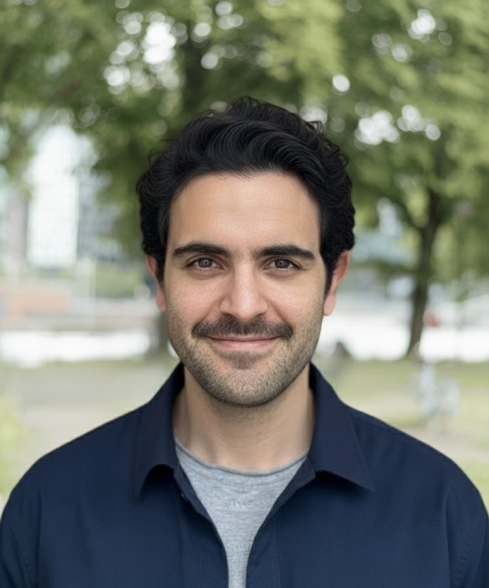
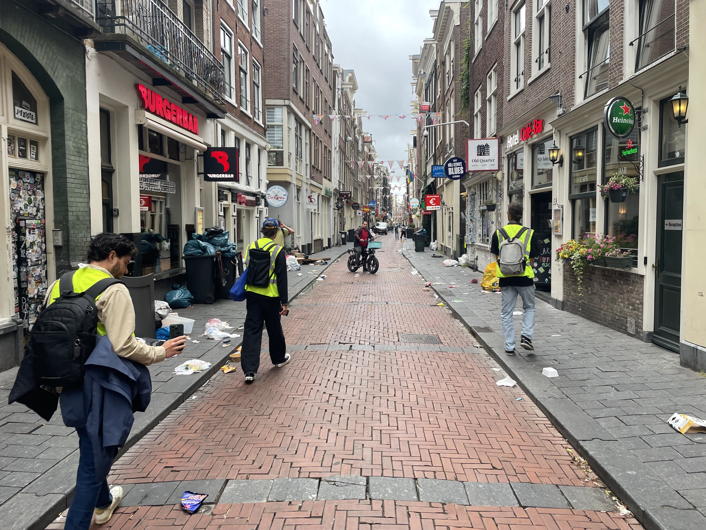
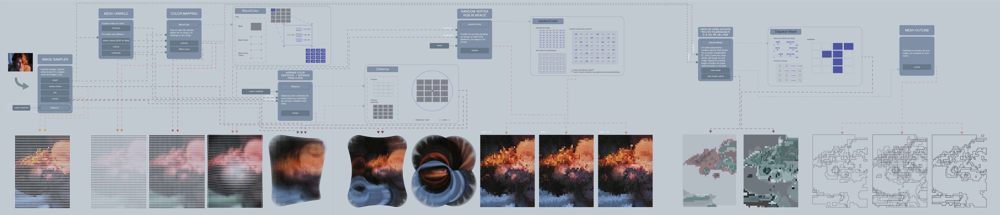

## About me

> _Professional in urban innovation and environmental governance with a transdisciplinary background spanning Europe and Latin America. I combine research, design methodologies, and strategic coordination to support sustainable transitions, stakeholder engagement, CSR initiatives, and policy development. My experience includes research-driven innovation within Amsterdam’s living labs and multi-actor municipal projects, where I’ve contributed to translate complex challenges into actionable strategies, facilitate co-creation, and strengthen governance processes. I’m motivated by roles that require translating complex challenges into actionable strategies, whether in climate adaptation, circularity, water governance, or urban development._

##### Reach out through [Linkedin](https://www.linkedin.com/in/juan-jose-corona/) or, if you want to learn about one of my hobbies, click [here](https://www.instagram.com/jjclucio).

---

# Master's Thesis Project

### [Picking Up De Wallen](page12.md)

The research demonstrates that research-driven tourism can transform the city into an active learning space where participants collaboratively make sense of social, material, and ethical complexities surrounding waste systems.

> 

# Multidisciplinary Collaborations

### [Clean Inner City Living Lab](page-1.md)

The living lab case highlights the gaps between the design of the waste management system and its real-world application, particularly in how waste is perceived and managed in the area.

> 

### [UnmuteCommute](page6.md)

Unmute Commute is an entrepreneurial venture that rethinks public transit as a social space, fostering connections between commuters through a data-driven, user-centric product.
>  

---

# Urban Research Projects

### [The Ex[cease]tance](page2.md)

The Exceasetance engages with the logistics of burial and its embedded power structures, critically examinining Western funerary practices through a Mexican cultural lens.

> 

### [Raindrops of Change](page3.md)

Decolonial Niche Innovations seeks to challenge the dominant paradigms of infrastructure and technological development by centering non-Western knowledge systems.

> 

### [Post-Covid19 Urban Dynamics in Mexico City | (1/2)](page4.md)

Acknowledging the oversupply of office spaces in the city and the financial inaccessibility of acquiring permanent housing, this research explores an alternative model of temporary urban living tailored for young professionals. 

> 

### [Follow-up Research: CLJT Housing Typology | (2/2)](page5.md)

By providing an accessible first step toward independent living, the researched housing model represents a progressive urban housing strategy—one that rethinks inclusion, affordability, and social mobility in one of the world's most dynamic metropolitan centers.

### [MEXICO CITY: Twelve archeologies of housing at a crossroads](page7.md)

The research focuses on analyzing and understanding collective housing models and how shared spaces within these models can serve as tools for social change.

> 

---

# Research & Design Projects

### [Wood Prototyping, Fabrication, & Community Engagement](page8.md)

Conceiving the use of wood, through forest use and maintenance, as an alternative material for construction, the present research and design project seeks to establish a closer dialogue between unskilled labor, the architect and digital design

> 

### [Tensegrity Pavilion – Digital Prototyping & Experimental Research](page9.md)

The research unfolded through a non-linear iterative process, integrating digital experimentation with the creation of physical prototypes within the lines of a tensegrity structural system.

>  

### [Codified Reinterpretation](page10.md)

From a reinterpretation of the creative process and the work of the North American artist Chuck Close, the formal results of his discourse were abstracted and translated into a digital form. 

> 

---

# Others

### [Foro/ENTRE/2020](https://issuu.com/escuadraarquitectura/docs/foro_entre_book)

### [Eco-Tequio, Oaxaca 2020](page11.md)
---

_Thanks for stopping by! I'm always open to new ideas, and good conversations_
