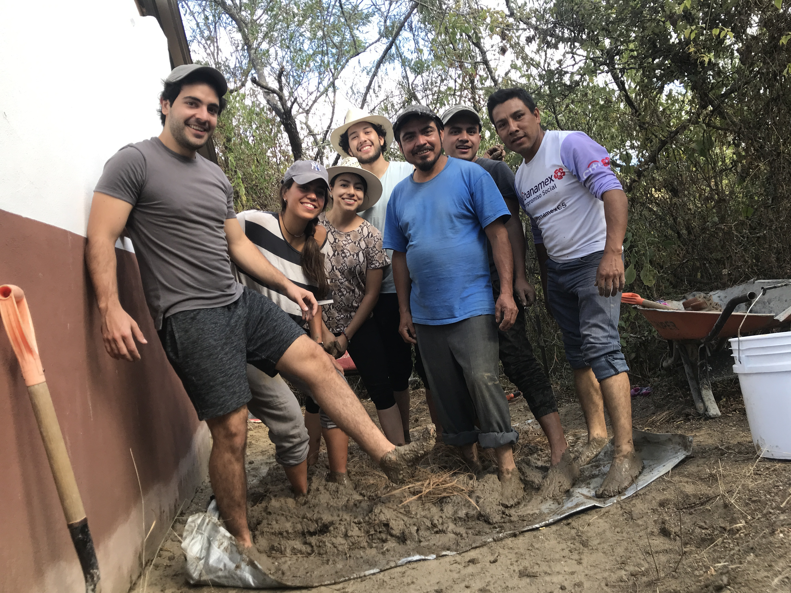

## About me

> _I help organizations make sense of complexity and design better ways of working together, working across systems thinking, facilitation, and strategic design. I move from diagnosis, understanding a problem as a system; to engagement, designing collective processes; to implementation, building and testing solutions._

> 

##### Reach out through [Linkedin](https://www.linkedin.com/in/juan-jose-corona/) or, if you want to learn about one of my hobbies, click [here](https://www.instagram.com/jjclucio).

---

# [Systems Mapping](page21.md)
### Projects where I diagnosed how a complex system works, identified patterns and constraints, and translated findings into visuals that enable decision-making and strategic alignment.

<iframe src="https://embed.kumu.io/c8831c515a7c4d2023fd3150483cdd0e" width="500" height="400" frameborder="0"></iframe> 

# [Facilitation & Engagement](page22.md) 
### Projects where processes and experiences brought diverse stakeholders together to develop shared understanding and co-create solutions.

> 

# [Prototyping & Fabrication](page23.md)
### Projects where concepts take form of mock-ups, and where material testing and hands-on experimentation are used to identify their scalability.

> 

# [Other](page24.md)
### Unclassified work that shaped my approach. Student organizing, professional experience in commercial design, hands-on community builds, and art for the sake of it.

> 

 
 
 

_Don't forget to click through!_
