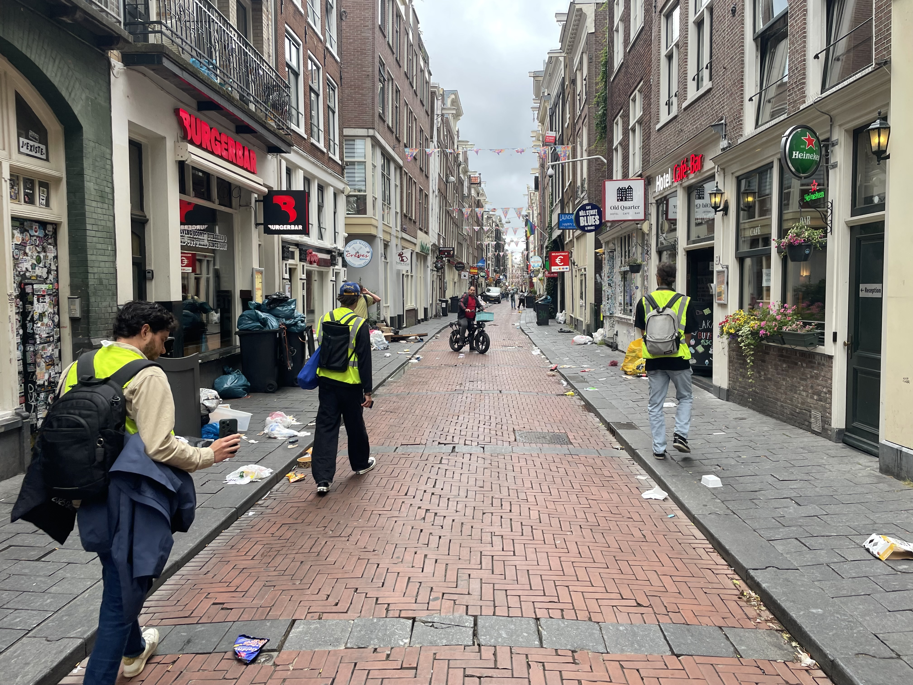
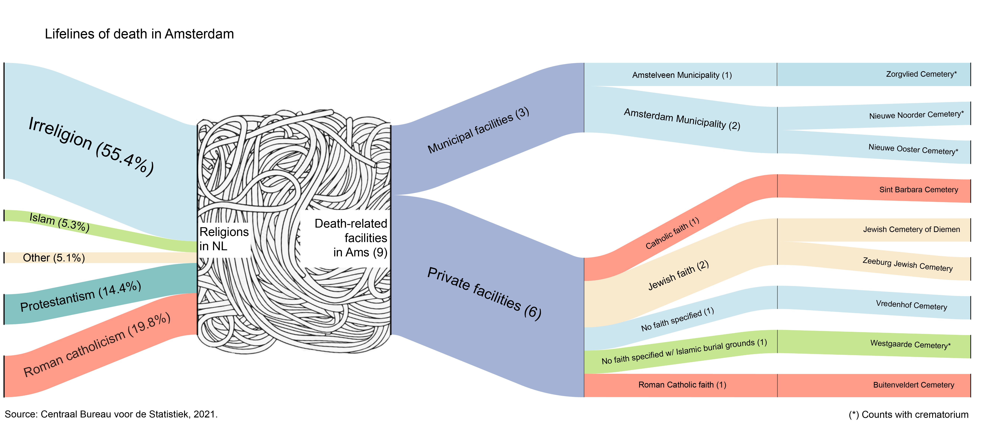
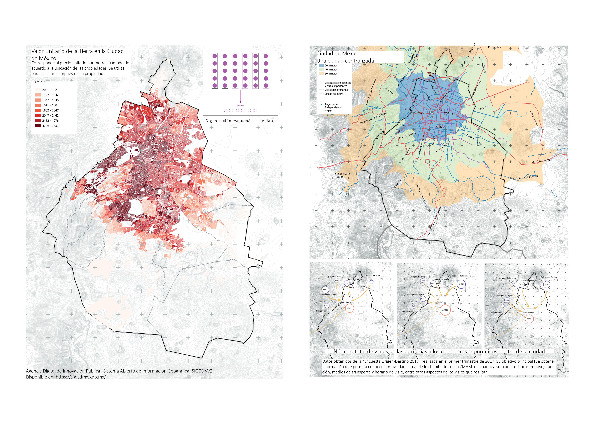
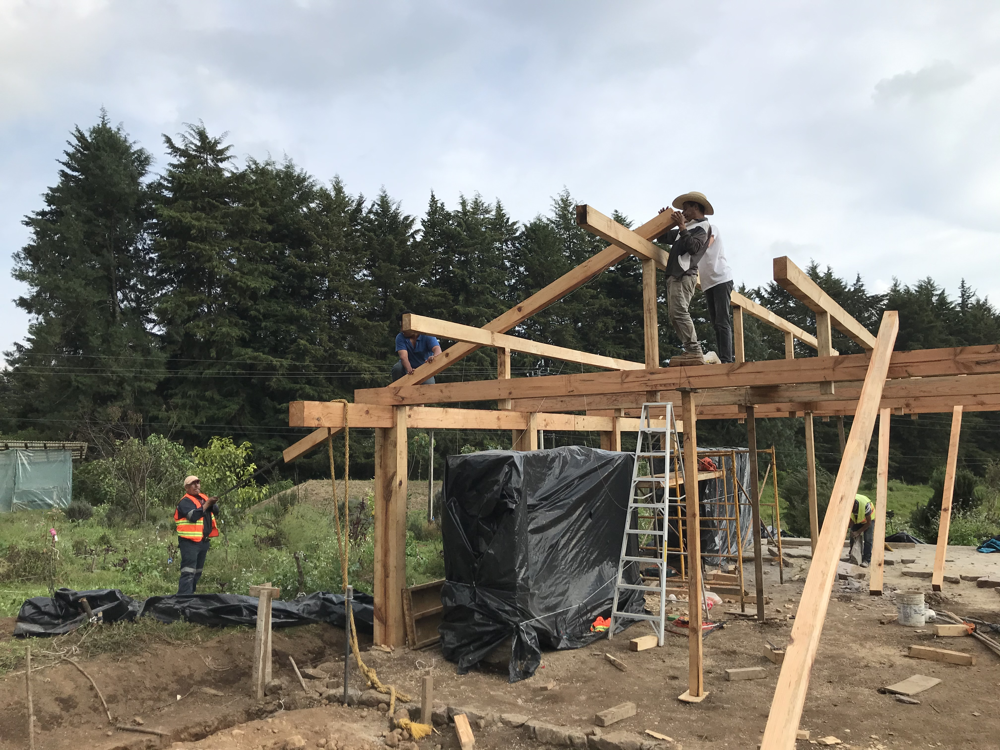
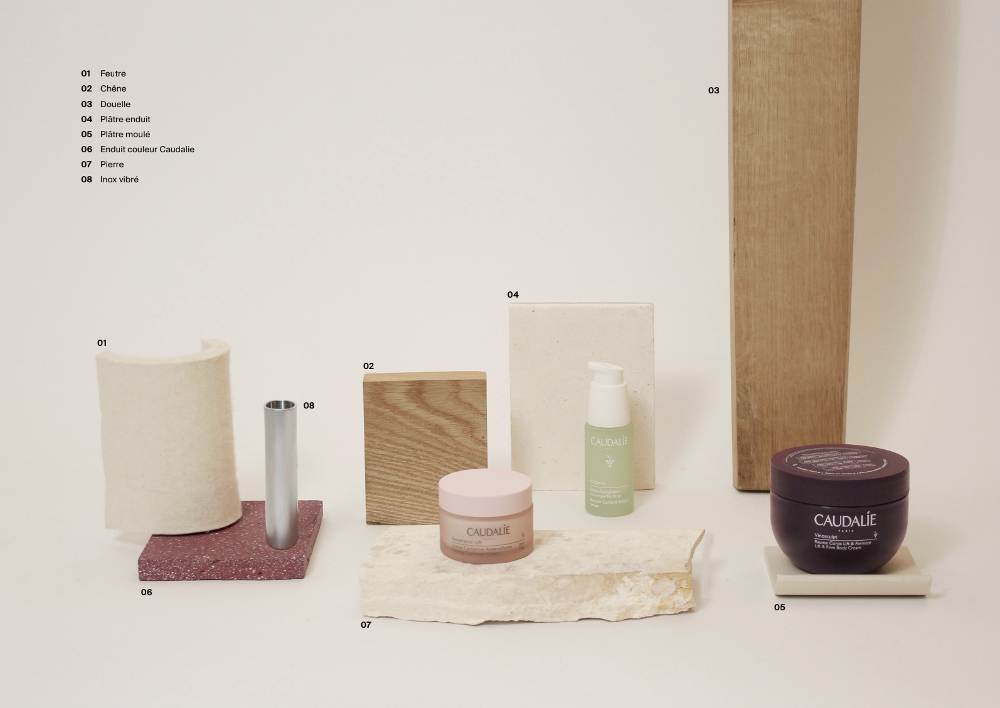

## About me

> _I'm a transdisciplinary professional working at the intersection of urban innovation, environmental governance, and systemic design. My background spans Europe and Latin America, where I've developed expertise in translating between research, design, and policy to unlock sustainable transitions._
>
> _I solve complex problems by understanding real constraints and identifying where leverage exists in a system. Rather than applying generic solutions, I design, implement, and measure interventions that work within actual governance structures, stakeholder dynamics, and material realities. This requires moving between disciplines and engaging people from all sorts of backgrounds and specializations._
>
> _My work across México, France, and the Netherlands has taught me that systemic change happens when you see problems at multiple scales simultaneously and create conditions for different actors to collaborate. I'm driven by the challenge of turning complex sustainability and governance problems into tangible, measurable outcomes._

> 

##### Reach out through [Linkedin](https://www.linkedin.com/in/juan-jose-corona/) or, if you want to learn about one of my hobbies, click [here](https://www.instagram.com/jjclucio).

---

# Facilitation & Collective Mobilisation

### [Picking Up De Wallen: Utilizing Toxic Tours as Research-Driven Tourism and Stakeholder Engagement](page12.md)

The research demonstrates that research-driven tourism can transform the city into an active learning space where participants collaboratively make sense of social, material, and ethical complexities surrounding waste systems. This work demonstrates how to mobilize diverse groups around complex and uncomfortable urban challenges, turning avoidance into engagement through designed experiences and participatory processes.

> 

# Systems Research & Urban Governance

### [Clean Inner City Living Lab](page-1.md)

The Living Lab case highlights the gaps between the design of the waste management system and its real-world application, particularly in how waste is perceived and managed in the area.

> 

### [The Ex[cease]tance](page2.md)

The Exceasetance engages with the logistics of burial and its embedded power structures, critically examinining Western funerary practices through a Mexican cultural lens.

> 

### [Raindrops of Change](page3.md)

Decolonial Niche Innovations seeks to challenge the dominant paradigms of infrastructure and technological development by centering non-Western knowledge systems.

> 

### [Post-Covid19 Urban Dynamics in Mexico City | (1/2)](page4.md)

Acknowledging the oversupply of office spaces in the city and the financial inaccessibility of acquiring permanent housing, this research explores an alternative model of temporary urban living tailored for young professionals. 

> 

### [Follow-up Research: CLJT Housing Typology | (2/2)](page5.md)

By providing an accessible first step toward independent living, the researched housing model represents a progressive urban housing strategy—one that rethinks inclusion, affordability, and social mobility in one of the world's most dynamic metropolitan centers.

### [MEXICO CITY: Twelve archeologies of housing at a crossroads](page7.md)

The research focuses on analyzing and understanding collective housing models and how shared spaces within these models can serve as tools for social change.

> 

---

# Product & Venture Design

### [UnmuteCommute](page6.md)

Unmute Commute is an entrepreneurial venture that rethinks public transit as a social space, fostering connections between commuters through a data-driven, user-centric product.
>  

---

# Design & Fabrication

### [Wood Prototyping, Fabrication, & Community Engagement](page8.md)

Conceiving the use of wood, through forest use and maintenance, as an alternative material for construction, the present research and design project seeks to establish a closer dialogue between unskilled labor, the architect and digital design.

> 

### [Designing for Experience](page14.md)

This project exemplifies how design translates intangible values into material systems that shape how users experience beauty and meaning. In Caudalie's case, wine heritage and wellness become coherent sensory ecosystems through nested relationships between concept, material, and user interaction. By understanding how technical systems (material sourcing, spatial acoustics, thermal properties) integrate with human perception, design becomes infrastructure for measurable outcomes such as deeper user engagement, brand coherence, and market differentiation.

> 

### [Tensegrity Pavilion | Digital Prototyping & Experimental Research](page9.md)

The research unfolded through a non-linear iterative process, integrating digital experimentation with the creation of physical prototypes within the lines of a tensegrity structural system.

>  

### [Codified Reinterpretation](page10.md)

From a reinterpretation of the creative process and the work of the North American artist Chuck Close, the formal results of his discourse were abstracted and translated into a digital form. 

> 

### [Macramé Catenary Structures Under Tension: Analogue Fabrication and Digital Form-Finding](page16.md)

Using form-finding principles, minimal surfaces, and geometric and structural properties, this workshop-based research developed team investigations exploring the capabilities of physical models, their variables, and the reasons behind specific structural outcomes.

> 

### [Exogenous Protocols Endogenous Properties](page15prexpren4.md)

A collective taxonomy of over 100 fabric-formed concrete pieces, generated within a shared constraint and evaluated as a grammar for structural aggregation.

> 

---

# Others

### [Foro/ENTRE/2020](https://issuu.com/escuadraarquitectura/docs/foro_entre_book)

### [Eco-Tequio, Oaxaca 2020](page11.md)

### [Artworks](page13.md)
---

_Thanks for stopping by! I'm always open to new ideas, and good conversations_
