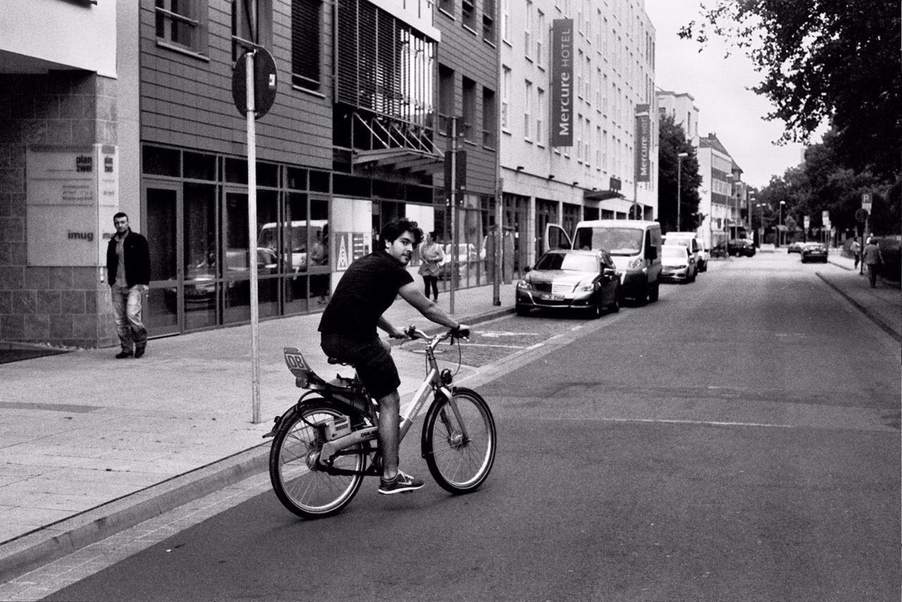
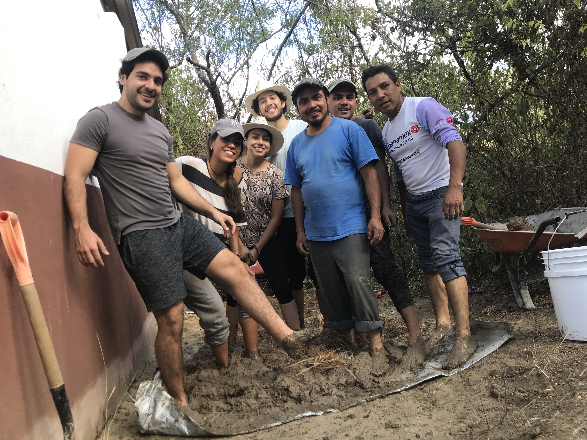

## About me

> _I'm a systems thinker trained as a designer and an engineer. I like to think about the broad systems in the world and understand how they impact us as different scales. This in order to envision alternative forms of building our world._
>
> _The work sits in three places: [diagnosing systems](page21.md), [designing collective processes](page22.md), and the [design methods](page23.md) that shape how I approach both.

> 

##### Reach out through [Linkedin](https://www.linkedin.com/in/juan-jose-corona/) or, if you want to learn about one of my passions, click [here](https://www.instagram.com/jjclucio). I am also an amateur worm composter 👨‍🌾🪱🌱.

---

# [Systems mapping](page21.md)
Projects where I diagnosed how a complex system works, identified patterns and constraints, and translated findings into visuals that enable decision-making and alignment.

<iframe src="https://embed.kumu.io/c8831c515a7c4d2023fd3150483cdd0e" width="300" height="200" frameborder="0"></iframe>

# [Facilitation & engagement](page22.md) 
Projects where processes and experiences brought diverse stakeholders together to develop shared understanding and co-create.

> 

# [Prototyping & fabrication](page23.md)
Projects where concepts take form of mock-ups, and where material testing and hands-on experimentation were used to identify their scalability.

> 

# [Other](page24.md)
Unclassified work that shaped my approach. Student organizing, professional experience in commercial design, hands-on community construction sprints, and art for the sake of it.

> 

 
 
 

_:)_
