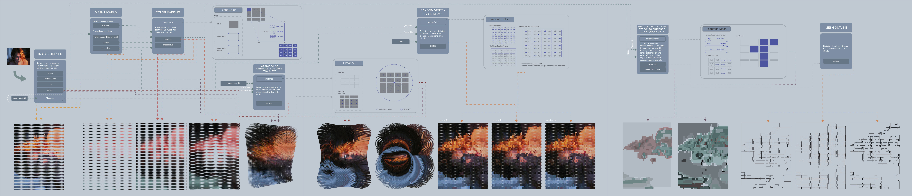

## Codified Reinterpretation
###### _Design with Python_

The development of this project involved a way of thinking that differs from that of our language; The structure and breakdown of this program was adapted to a grammar and syntax different from what we know.

The project originates a non-linear way of thinking where the permutations of its composition exhaust the capacity of the tools with which we design, resulting in highly complex proposals and exceeding the human capacity to carry them out.

By incorporating different geometric configurations, their variables and their ordering, and starting from the same creative intention, different results are obtained that resem- ble Close’s work.

[back](./)
