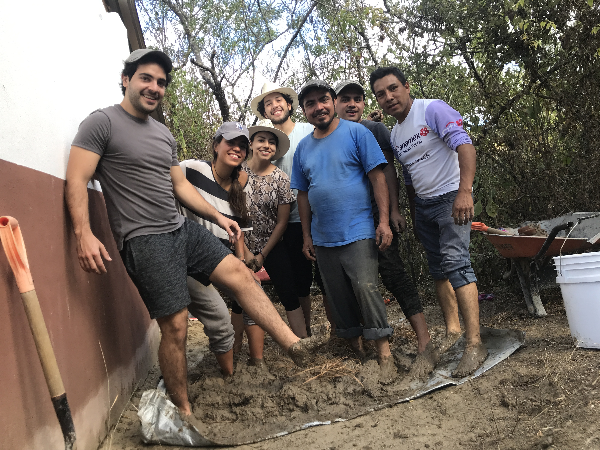
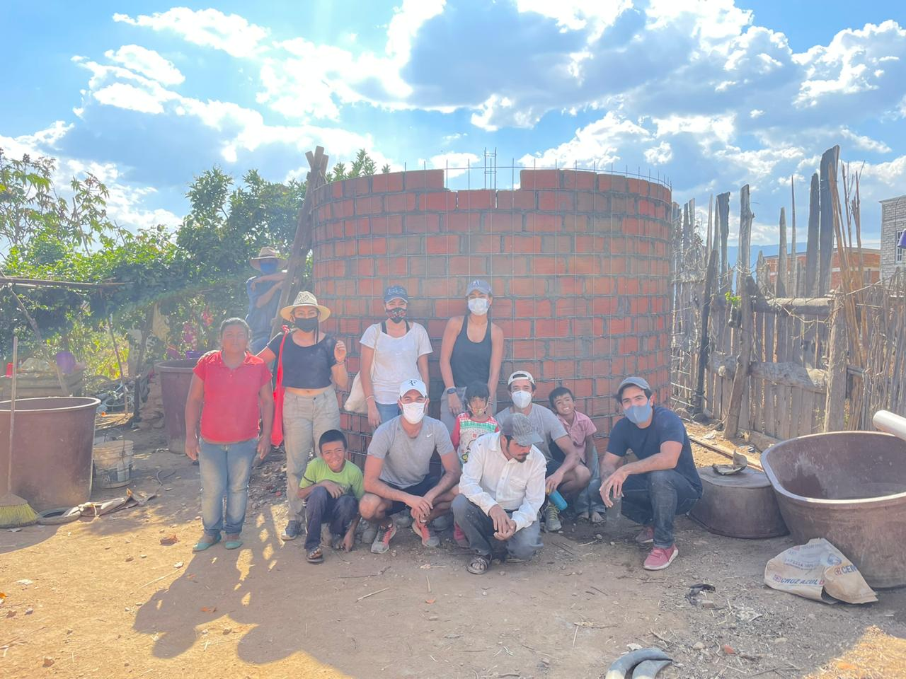
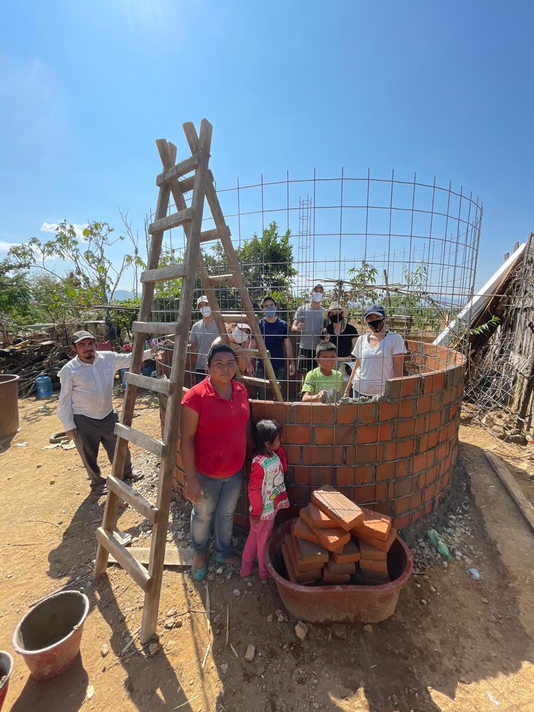
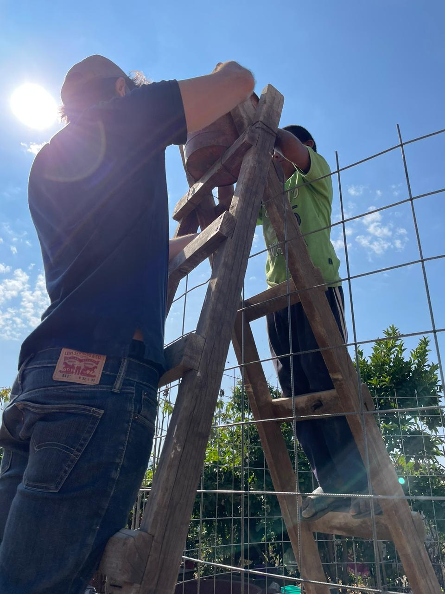
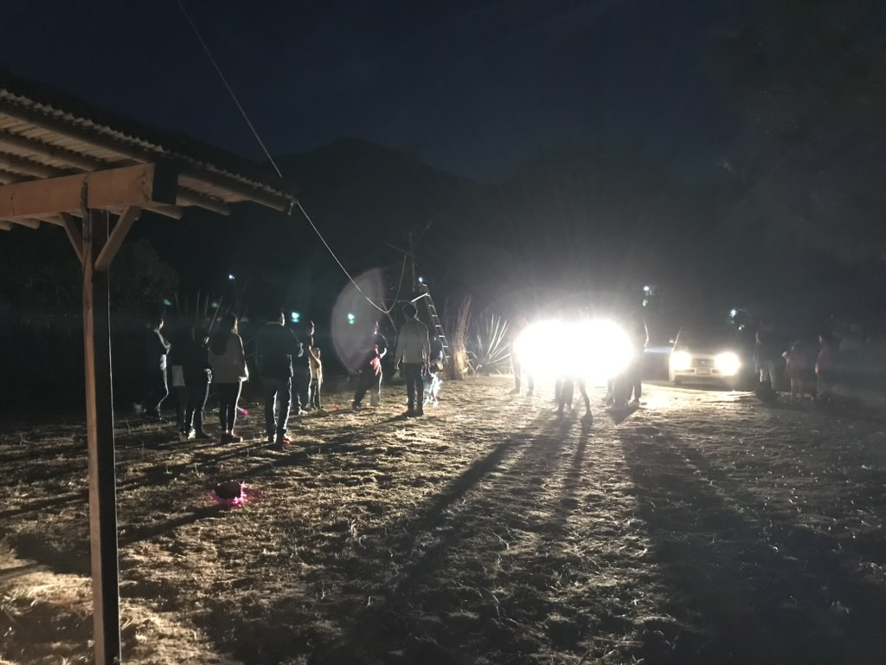
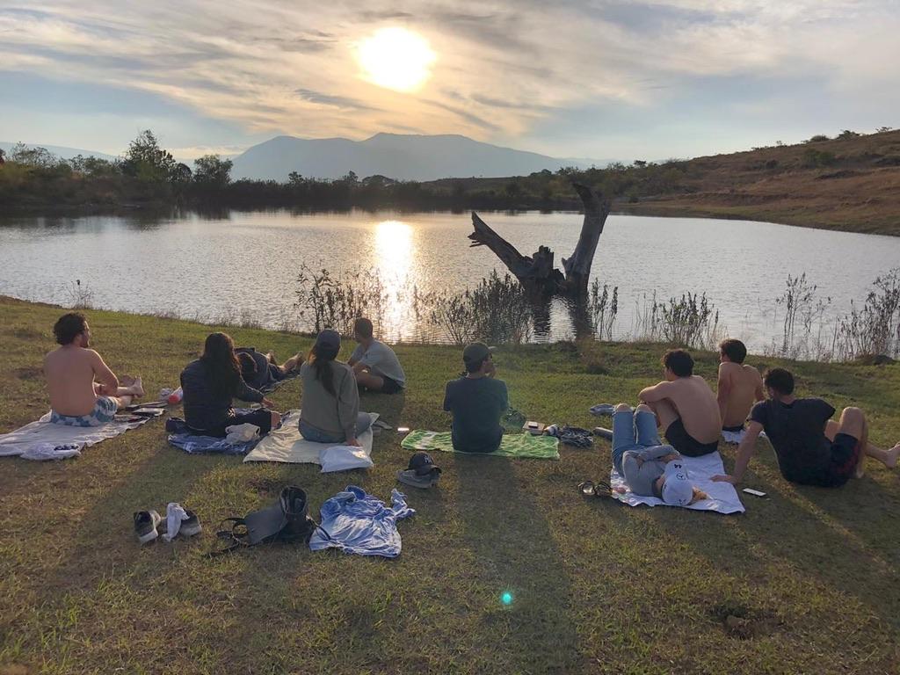

### ECO-TEQUIO Volunteer Experience
#### Oaxaca, December 2020
###### A Sustainable Development & Community Engagement Program

Participated in ECO-TEQUIO, a hands-on sustainability and community service program focused on environmental conservation and social impact. The initiative aimed to improve water accessibility and promote local craftsmanship in rural communities.

#### Skills & Lessons Learned:

* Sustainable Development – Gained practical experience in eco-friendly infrastructure projects.

* Community Engagement – Learned to work closely with local populations, understanding their needs and traditions.
* Adaptability & Teamwork – Worked in diverse environments, adapting to different challenges and collaborating with peers.

#### Key Responsibilities:

* Assisted in the construction of rainwater cisterns to support water conservation efforts in underserved communities.

* Engaged in community work and social impact activities, collaborating with local residents and organizations.
  
  

  
  
* Took part in eco-awareness discussions and sustainability practices, deepening understanding of resource management.
* 
* Assisted in organizing and participating in cultural exchange activities, including welcome and farewell bonfires and an eco-hike to a mountain viewpoint.

  
  

[back](./)
