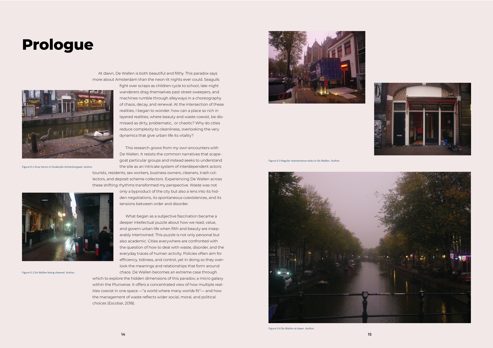
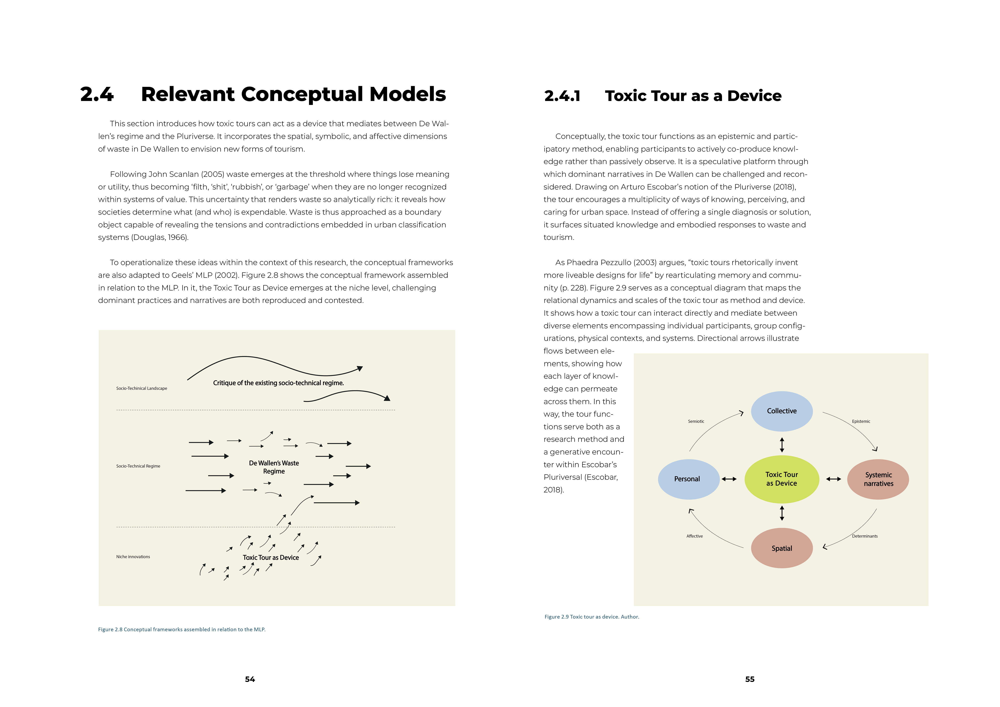
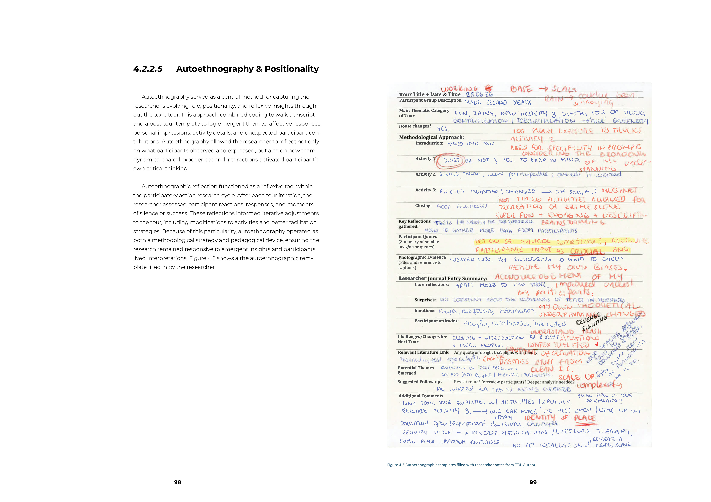

## Picking Up the Red-Light District
### Utilizing Toxic Tours as a method for Research-Driven Tourism and Stakeholder Engagement in addressing waste in the De Wallen District

##### Abstract

This thesis examines the use of toxic tours as a method to research waste, tourism, and toxicity in Amsterdam’s Red-Light District. The research incorporates perspectives from Discard Studies, Degrowth, and Critical Design to frame waste as a relational, cultural, and political phenomenon rather than an ‘issue’ to be solved. Toxic tours, or guided critical walks, positioned participants as co-researchers, engaging them in structured, hands-on process such as observ- ing, photographing, collecting, and reflecting on discarded items.

The study identified five recurring patterns of learning: (1) connection with others creates understanding, (2) playfulness and creativity unlock insights, (3) real-time reflection deepens awareness, (4) small acts of care ground learning in practice, (5) iterative design enables deeper learning. These experiences revealed hidden infrastructures, moral hierarchies, and socio-economic inequalities. They also helped participants develop emotional, ethical, and big-picture understandings that traditional tourism or research rarely offer. Participants shifted from seeing waste as an individual responsibility to understanding it as a shared sys- temic responsibility, demonstrating how tourism can function as a medium for learning, reflection, and collective action..

Methodologically, the research shows how hands-on, critical approaches can shift power, challenge dominant stories, and imagine new ways of living in the city, aligning with Escobar’s (2018)idea of the pluriverse. Although participants experienced strong emotional and perceptual shifts, lasting behavior change was limited. This suggests a need for ongoing or supported forms of engage- ment. Toxic tours turn extractive forms of tourism into opportunities for care, ethical awareness, and regeneration by framing travel as a space for reflection, learning, and shared action. This approach offers a practical model for research- ers, policymakers, and practitioners working toward more sustainable and partic- ipatory urban futures.

  

[back](./)

