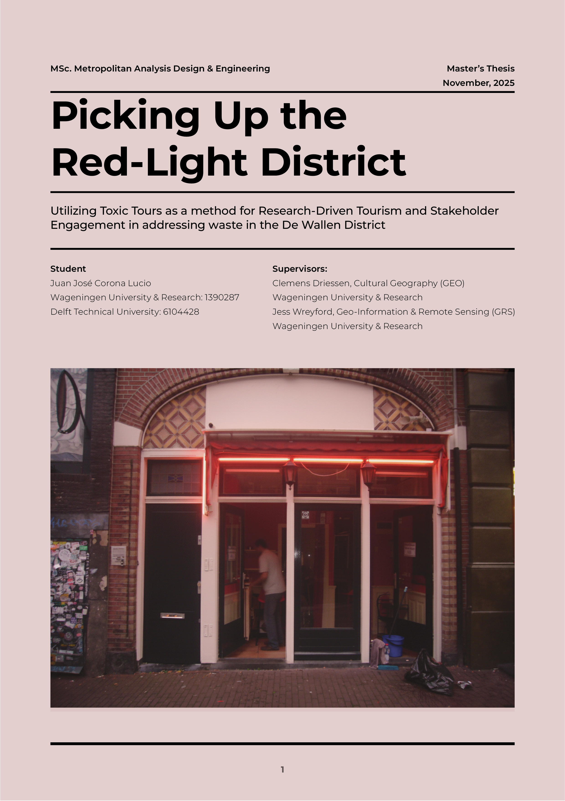
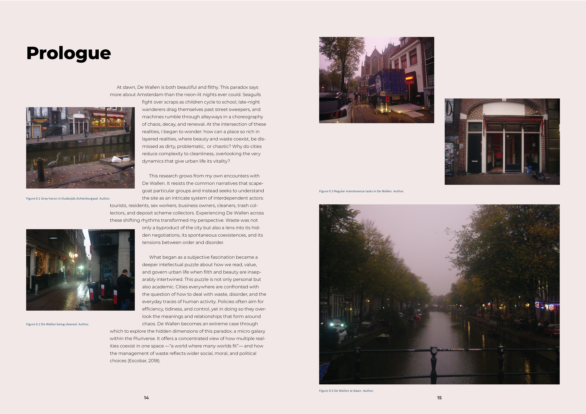
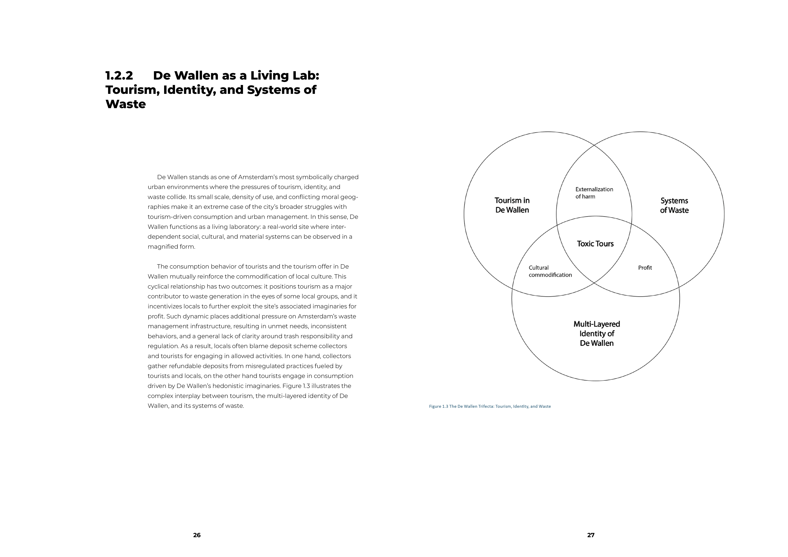
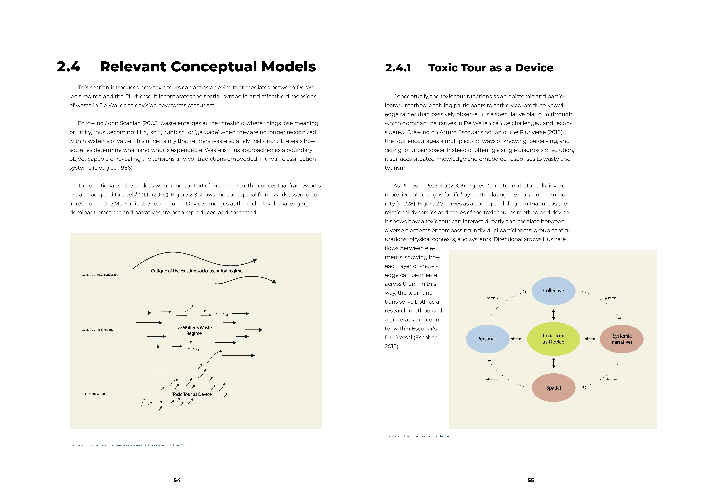
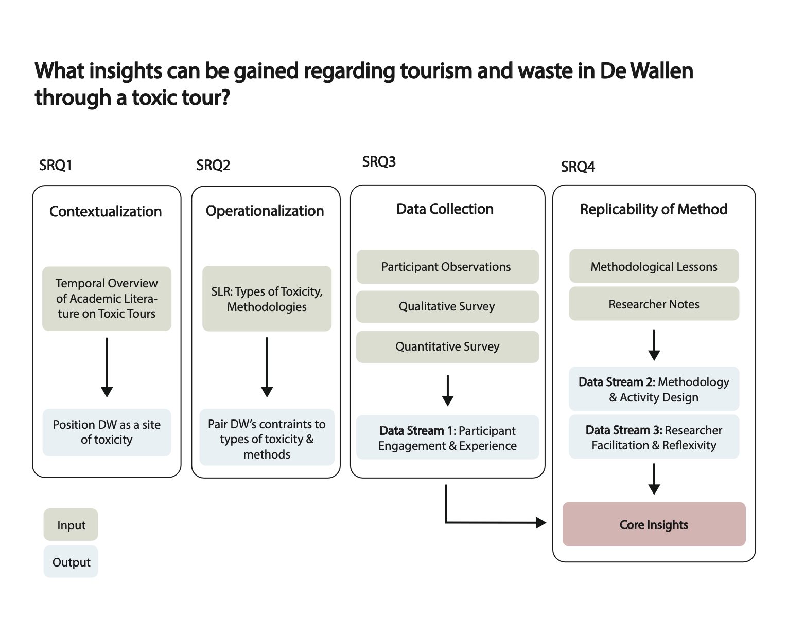
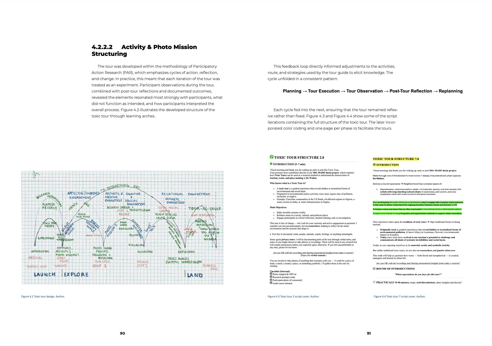
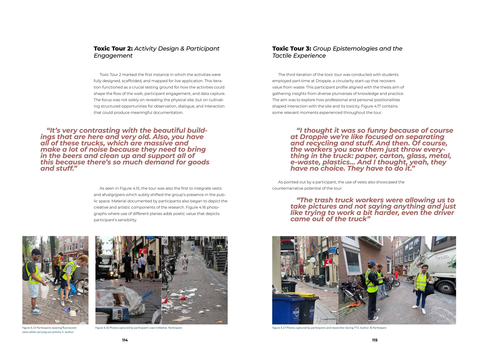
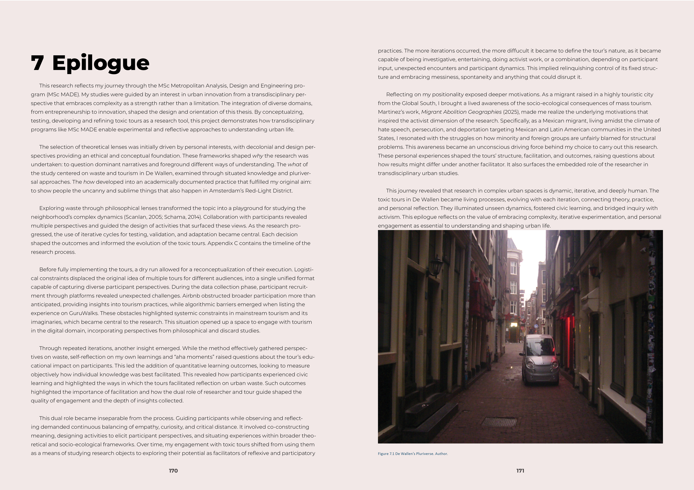

## Picking Up the Red-Light District:
### Utilizing Toxic Tours as a method for Research-Driven Tourism and Stakeholder Engagement in addressing waste in the De Wallen District

A research methodology designed as an embodied sensemaking process: nine critical walking tours through Amsterdam's Red-Light District, structured across three co-creation phases, using tourism as both the medium and the object of inquiry. The research produced five recurring patterns of learning showing how playfulness, real-time reflection, and iterative design unlock systemic understanding in ways that traditional research rarely achieves.

#### Cover

#### Prologue

#### Problem contextualization
Situates the intervention within Amsterdam's Red Light District governance dynamics and complex identity, giving reference for why existing tourism is commonly associated with trash and seen as undesireable, and why management approaches fail to address underlying systemic tensions.

#### Conceptual models
Conceives the use of toxic tours as devices that can harvest participant knowledge at different scales, starting from embodied experience and connecting it into dominant systems.

#### Methodology 
Documents how each phase was designed to build on the previous one, creating an adaptive but structured process that could respond to what participants actually surfaced rather than what was anticipated.

#### Operationalization

Documents how participants were positioned as co-researchers, not subjects, and how the researcher's own positionality was made visible as part of the sensemaking process.

##### Activity and photo mission structuring
Participants were positioned as co-researchers, not subjects. 

##### Autoethnography and positionality
The researcher's own positionality was made visible as a methodological instrument, enabling the group to interrogate assumptions together rather than receive findings.

#### Walk results 
The process produced patterns, tensions, and insights that emerged from situated participatory inquiry and fed directly into what critical walking methodologies need to have for better stakeholder alignment around contested urban dynamics.

#### Epilogue 

  

[back](./)

