## Exogenous Protocols, Endogenous Properties
### Fabric formwork, collective constraint, and the structural logic of poured concrete

_A workshop-based research project exploring structural and spatial possibilities within a shared constraint: a wooden frame, 80 × 80 × 20 cm, fabric stretched inside, concrete poured in. Each participant worked within identical boundaries to generate a distinct piece. The collective output mapped over 100 variations across four structural families, documented in a shared taxonomy built from individual iteration._

###### Filogenetic Tree

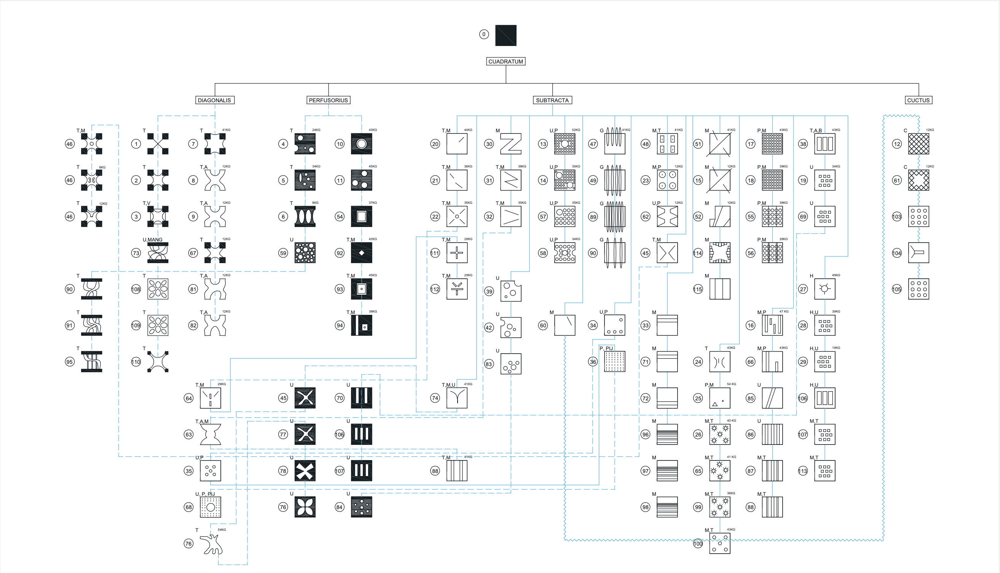

_The personal research focused on pieces P.7, P.8, P.9, P.67, P.81, and P.82, tracing how small changes in fabric geometry, pour sequence, and setting conditions produced radically different structural outcomes. Each iteration was evaluated across six variables: intention, emptying, curvature, setting time, tension/compression/gravity, and conclusion. P.8 and P.82 emerged as the most resolved, both achieving 12 kg final weight with consistent double-curvature geometry._

###### Personal Research

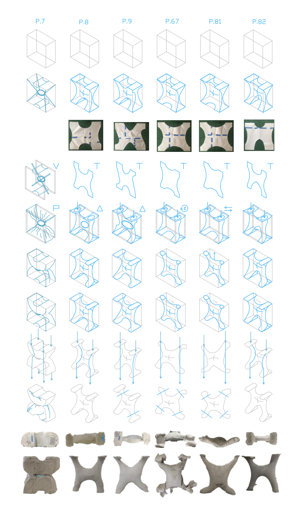

The fabrication process moved between 2D fabric cutting and digital diagramming, using parametric form-finding to anticipate how gravity, hydraulic pressure during pouring, and differential setting times would deform the cast. Failures were as generative as successes: P.67, rotated hourly during setting, fractured at the joints between extremities and core, revealing how differential cure rates create internal stress concentrations.

###### Piece Evaluation

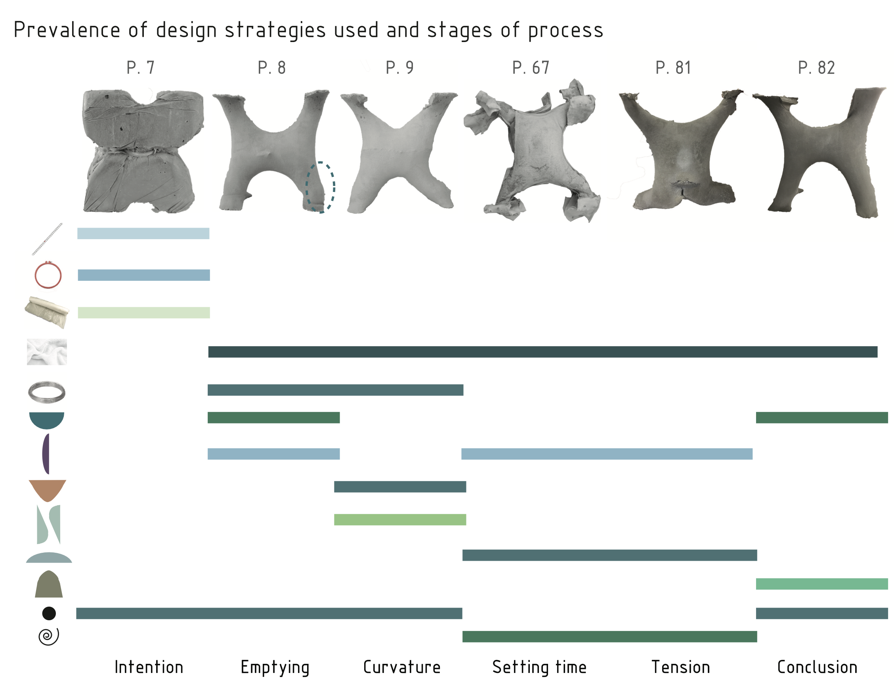

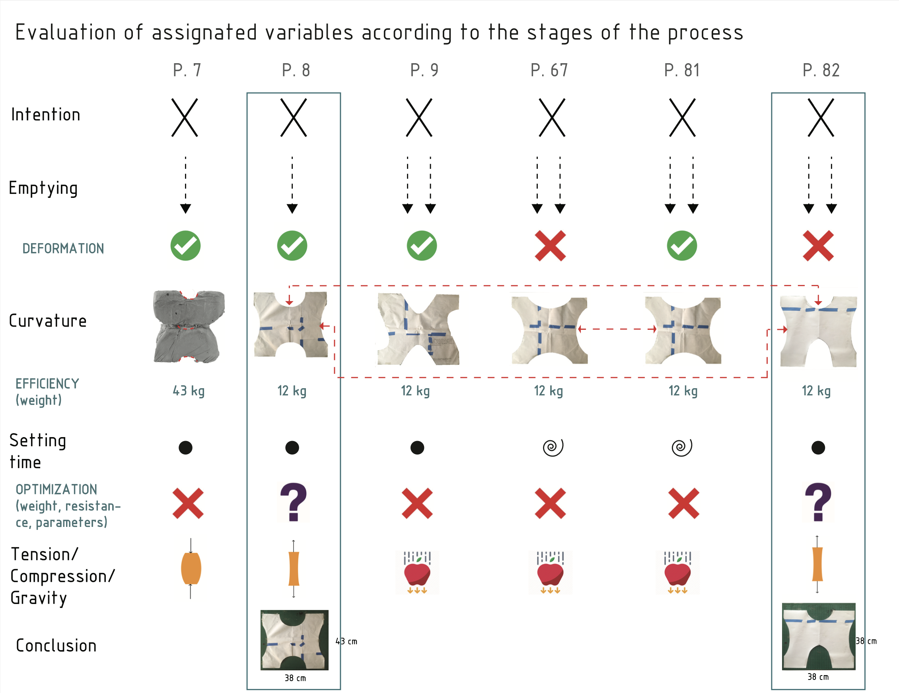

The most generative finding of this research was not a single piece but a method: that identical constraints produce divergent outcomes when material behavior is allowed to drive form. The 80 × 80 × 20 cm frame was never a limitation. It was the condition that made comparison, taxonomy, and collective knowledge possible. What began as individual exploration became a shared map of structural possibility.

###### Piece Specifications

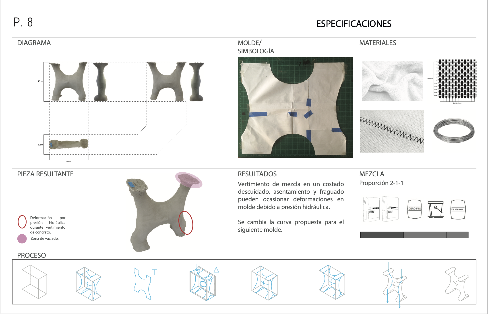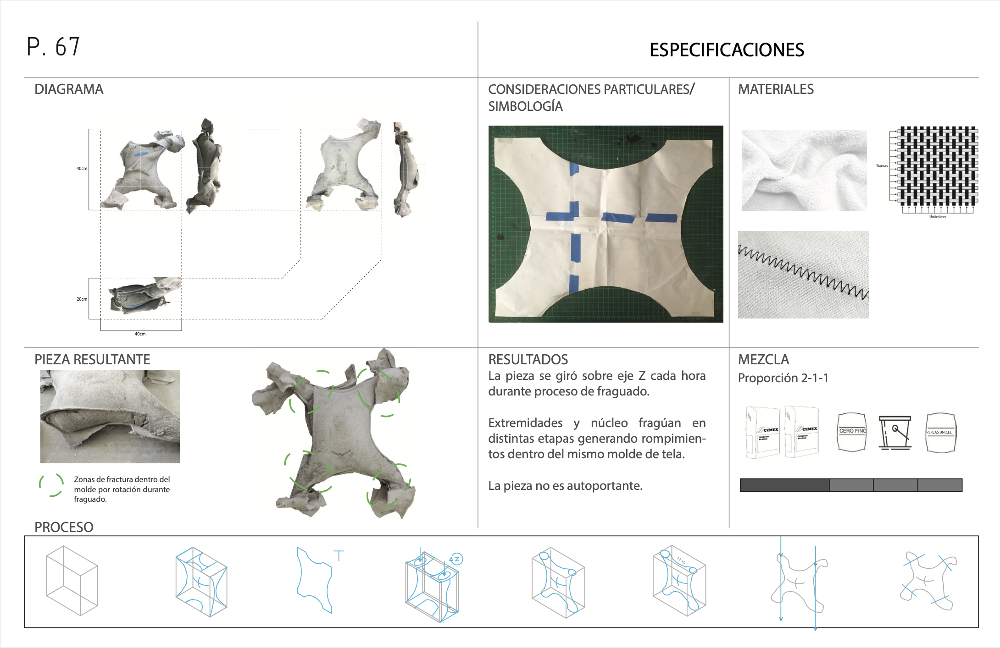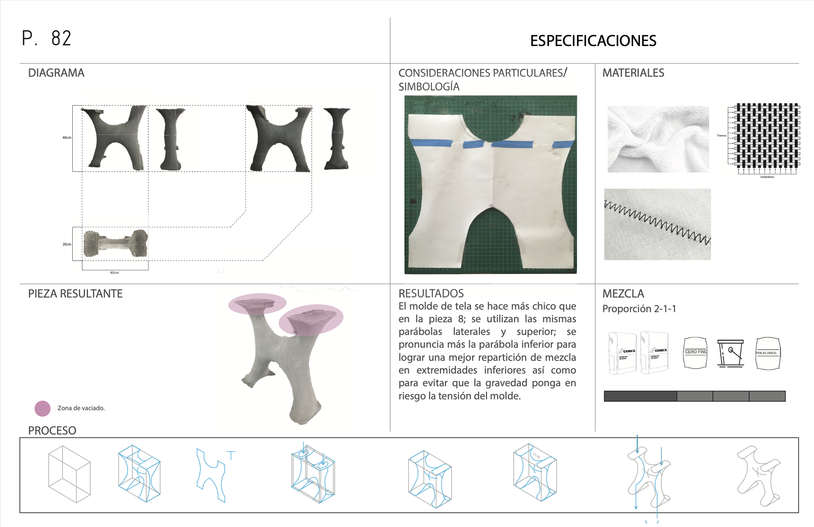

##### Fabrication Process

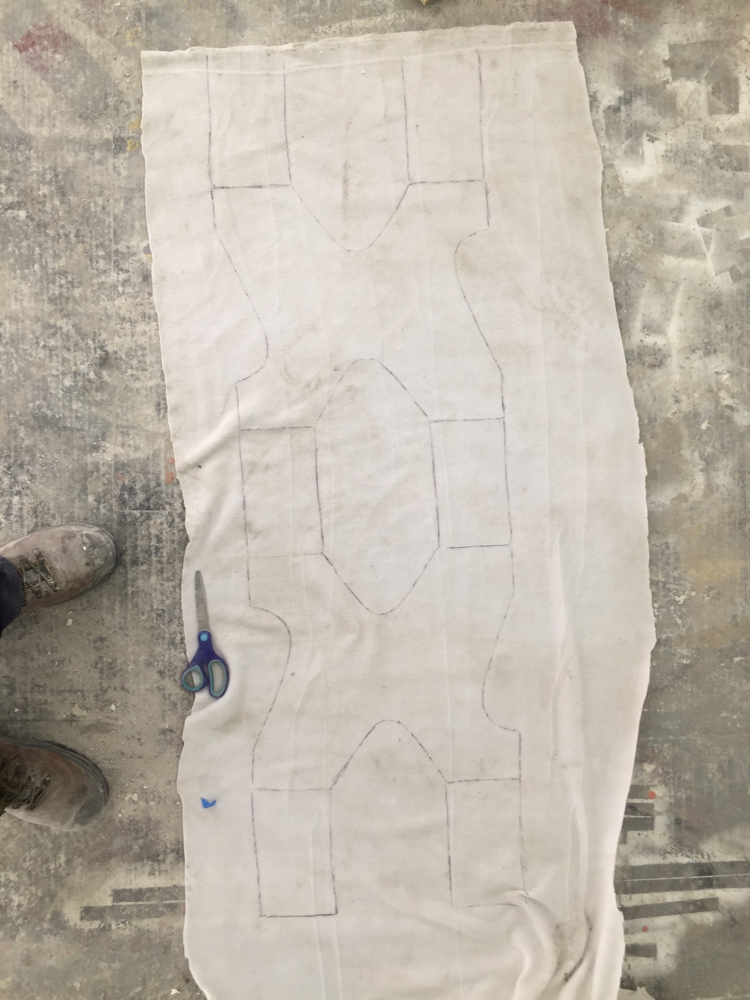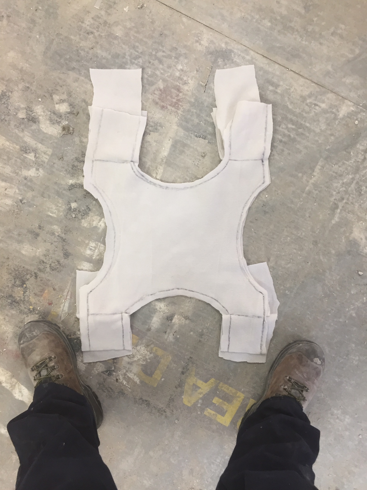
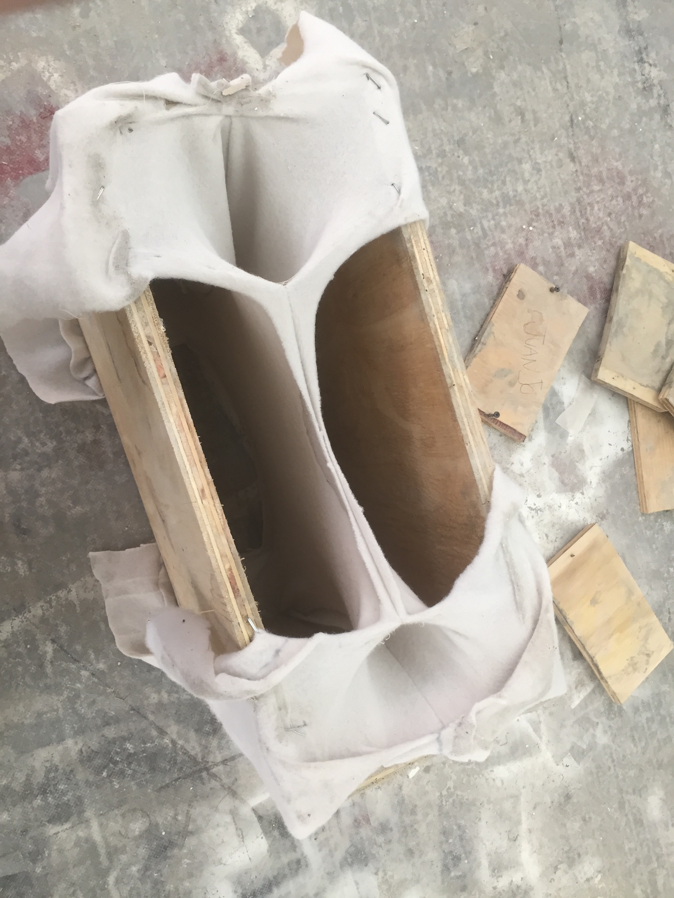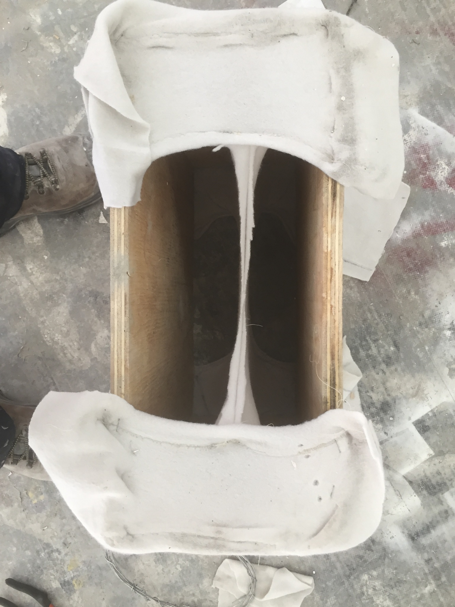

[back](./)

