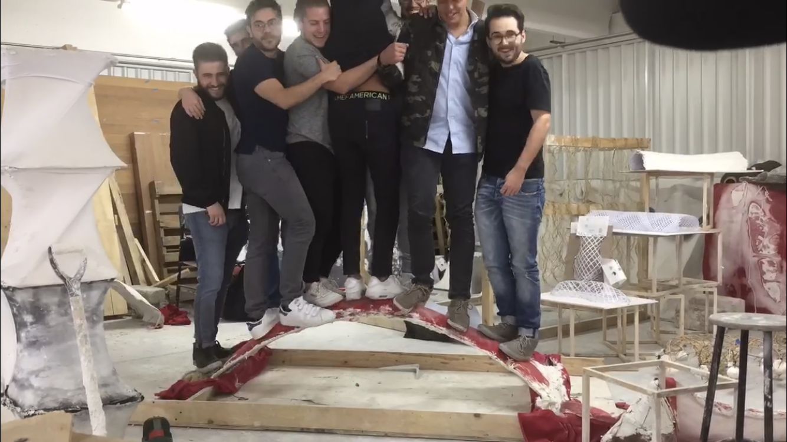

## Macramé Catenary Structures Under Tension:
###### _Analogue Fabrication and Digital Form-Findingn_

The research aimed to examine the behavior of selected structural typologies. The process began with double-curvature surfaces formed by shell structures, specifically self-supporting modular assemblies. Analysis of these forms, with the goal of achieving greater structural efficiency, opened further lines of inquiry: perforated structures and pneumatic structures.

The investigation then shifted toward pneumatic structures, which achieve rigidity through pressurized fluids. Perforations were introduced as a variant to produce lightweight, self-supporting forms. This second phase worked with an aggregate system using epoxy resin and white glue to stiffen fabric-based structures. In parallel, macramé weaves using henequén fibers were programmed as part of the same aggregate logic. This exploration led to the final research line: programmed woven structures in catenary form, composed through an aggregate system combining fabric, henequén fibers, concrete, and additives.

The final phase explored 2D geometries with the aim of scaling their structural properties. Applying form-finding principles, programmed weaving techniques were used to generate double-curvature surfaces and test their load-bearing capacity.
