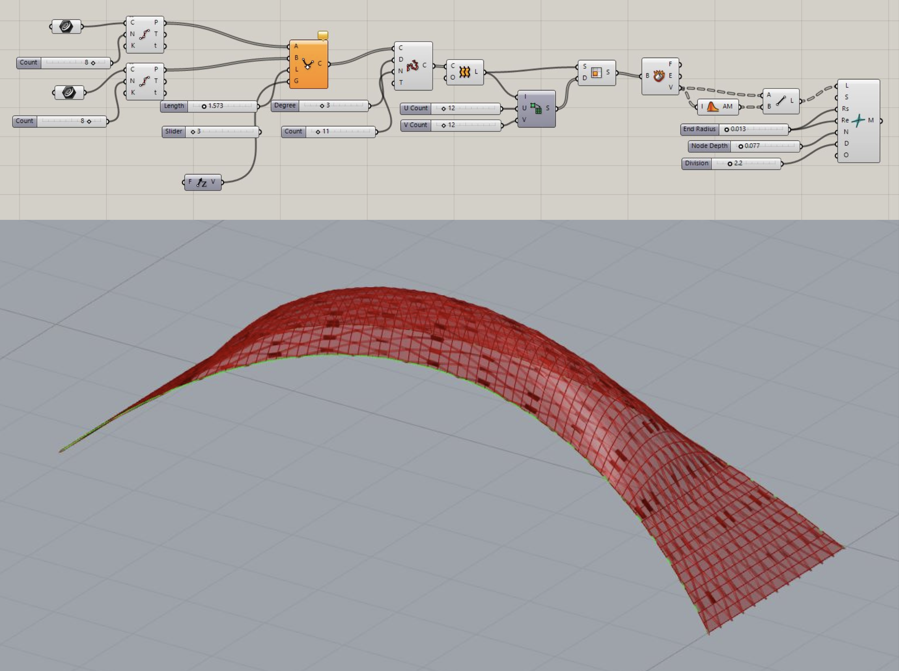
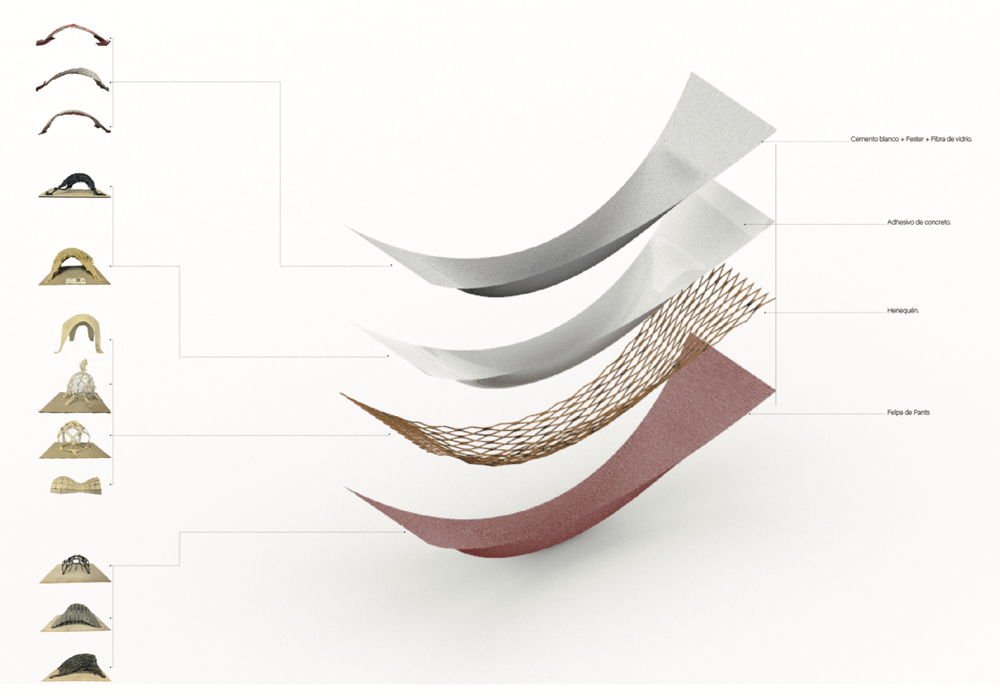
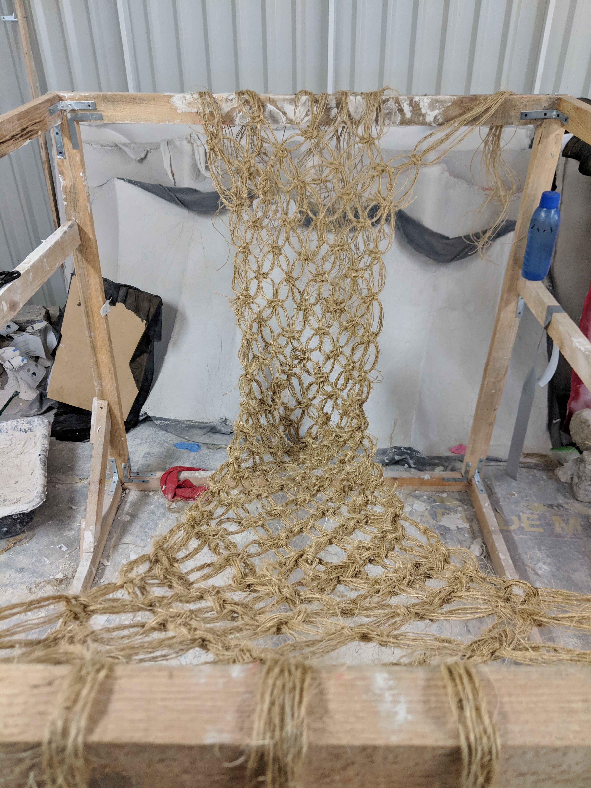
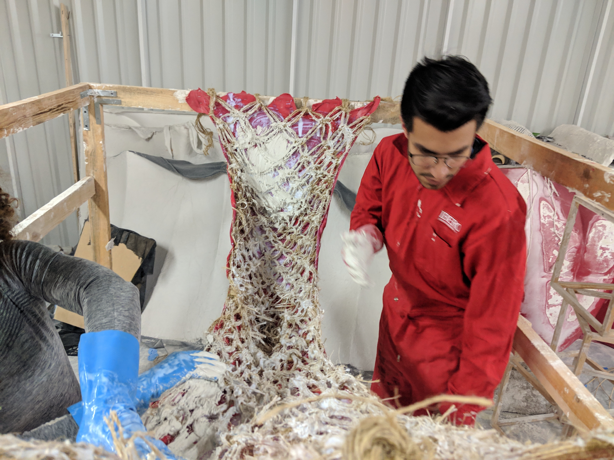

## Macramé Catenary Structures Under Tension: Analogue Fabrication and Digital Form-Finding
### **The research culminated in a 15kg woven structure that passed a load test of over 500kg.**

The research aimed to examine the behavior of selected structural typologies. The process began with double-curvature surfaces formed by shell structures, specifically self-supporting modular assemblies. Analysis of these forms, with the goal of achieving greater structural efficiency, opened further lines of inquiry: perforated structures and pneumatic structures. 

The final phase explored 2D geometries with the aim of scaling their structural properties. Applying form-finding principles, programmed weaving techniques were used to generate double-curvature surfaces and test their load-bearing capacity. The investigation shifted into macramé weaves using henequén fibers were programmed as part of the same aggregate logic. This exploration led to the final research line: programmed woven structures in catenary form, composed through an aggregate system combining fabric, henequén fibers, concrete, and additives.

###### Material testing

###### Definition

###### Final piece assembly from previous iterations

###### Final piece production

  

###### Stress resistance test

CATMcHn1.80x.80
A macramé catenary structure weighing under 15kg, load-tested to support eight people exceeding half a tonne combined weight.

[back](./)

