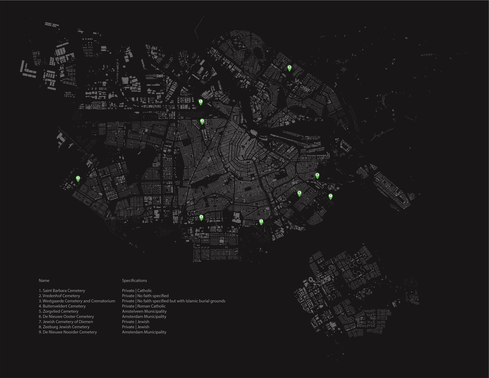
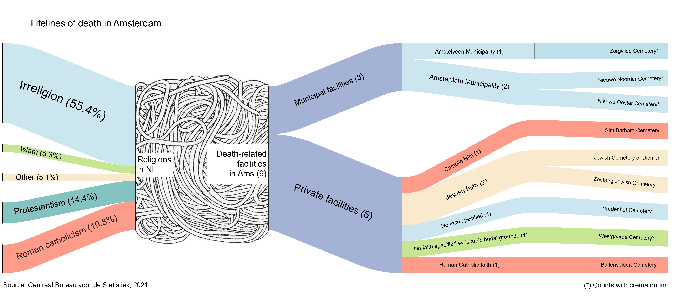

# Research & Design

## The Ex[cease]tance
### Reevaluating Death-Related Institutions in the Dutch Context: A Reflection on Modern Western Societies and the Potential for Healthier and Sustainable Practices.
###### _YMS30306_

Description

[back](./)
