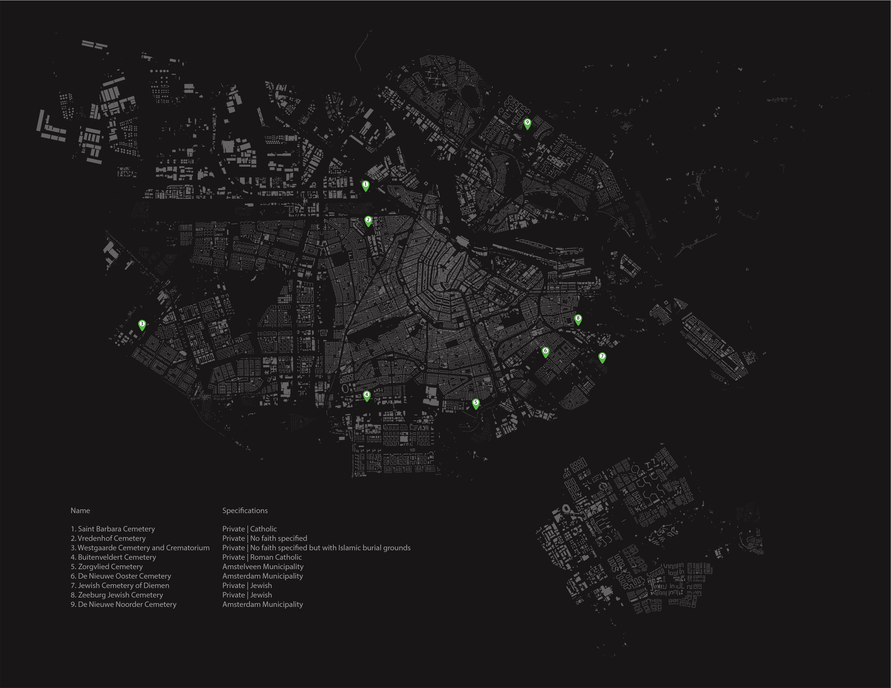
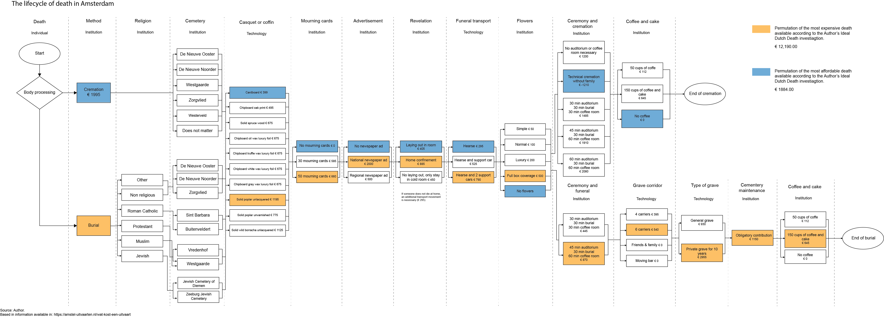

## The Ex[cease]tance
### Reevaluating Death-Related Institutions in the Dutch Context
###### _YMS30306 - Metropolitan Innovators_

As of 2024 Amsterdam has 1,182,000 inhabitants and 180 different nationalities

The map within The Exceasetance illustrates the scarcity and spatial distribution of cemeteries in compact cities like Amsterdam. Due to high urban density and limited land availability, cemeteries are predominantly located in peripheral areas, pushing burial practices away from the urban fabric and daily life. This spatial marginalization reflects a broader societal tendency to remove death from cotidianeity, treating it as an exceptional event rather than an integrated part of human experience.

This alienation of death within the cityscape results in a lack of everyday spaces for mourning, reflection, and connection with those who have passed. The map highlights how urban planning decisions have systematically removed burial sites from the rhythms of daily life, leaving people with few physical spaces to naturally process grief.

This diagram maps the movement of human bodies within burial processes, illustrating the intersection between religious beliefs, logistical operations, and spatial infrastructures. It visualizes how different burial systems manage corpses, from Western cemeteries to Indigenous and alternative practices. By tracking resource allocation (land, embalming chemicals, labor), it highlights disparities in burial accessibility and the persistence of colonial systems in death-related logistics.

A flow diagram mapping out the death and burial industry reveals how the process is structured into phases, the decisions involved, the associated expenses, and the emotional & financial pressure it imposes on grieving relatives—especially when arrangements have not been previously discussed.

[Full essay available upon request]

[back](./)
