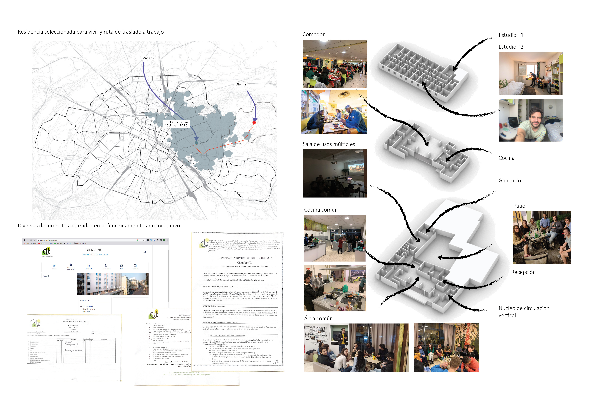

# Research & Design

## The Ex[cease]tance
### Reevaluating Death-Related Institutions in the Dutch Context: A Reflection on Modern Western Societies and the Potential for Healthier and Sustainable Practices.
###### _YMS30306_

Description

## Raindrops of Change: 
### Decolonial Niche Innovations and Decolonial Transition through the Multi-Level Perspective and Social Innovation
###### _CPT22806_

Description

## Post-Covid19 Urban Dynamics in Mexico City | (1/2)
###### _Personal project_

Description

## Follow-up Research: CLJT Housing Typology | (2/2)
###### _Personal project_

Description

[back](./)
