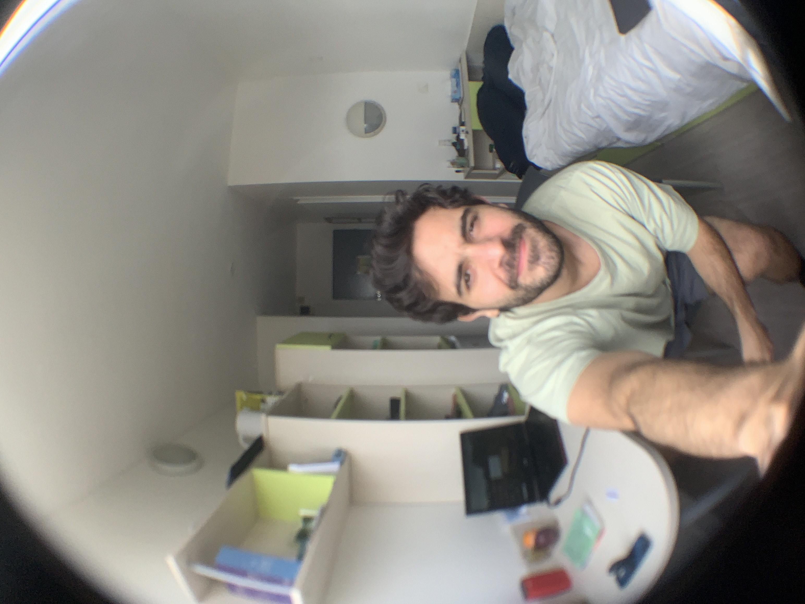

# [Facilitation & Engagement](page22.md) 

### [Toxic Tours in Amsterdam's Red Light District](page12.md)

How do you mobilise diverse groups around complex, uncomfortable urban challenges? This thesis used toxic tours in Amsterdam's Red-Light District to turn waste (a problem people avoid) into a shared object of inquiry, demonstrating how designed experiences can shift collective understanding from individual responsibility to systemic accountability.

> 

### [UnmuteCommute](page6.md)

An entrepreneurial venture rethinking public transit as social infrastructure. Combining physical tokens with a digital engagement platform, the project used GIS analysis, structured interviews, and iterative prototyping to design a scalable, human-centred product that transforms commuter waiting time into opportunity for connection.

> 
> 

### [What Paris Housing Can Teach Mexico City](page5.md)

A year living inside Paris's CLJT social housing model became the foundation for a research argument: that affordable, transit-integrated housing for young professionals in transition can be a replicable urban strategy with direct implications for Mexico City.

> 

---
[back](./)
