### Last Resort: Construction Festival 
#### Rubenscastle, Zemst, Belgium
###### [https://constructlab.net/projects/last-resort/]

Lived and built for 12 days inside Rubens Castle's grounds as part of ConstructLab's "Last Resort" summer school, working only with resources sourced from the site itself, alongside an international group of architects, designers, and artists. The residency mapped the domain's social and power dynamics through building, research, and performance, culminating in a guided tour that reinterpreted the castle for its neighbors and visitors.

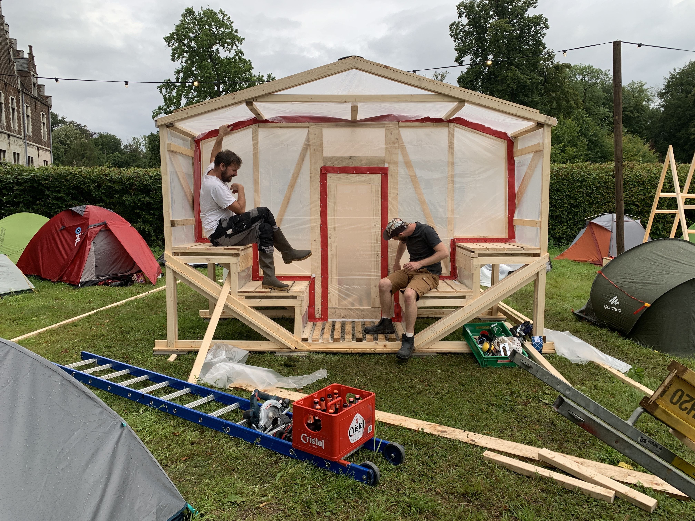
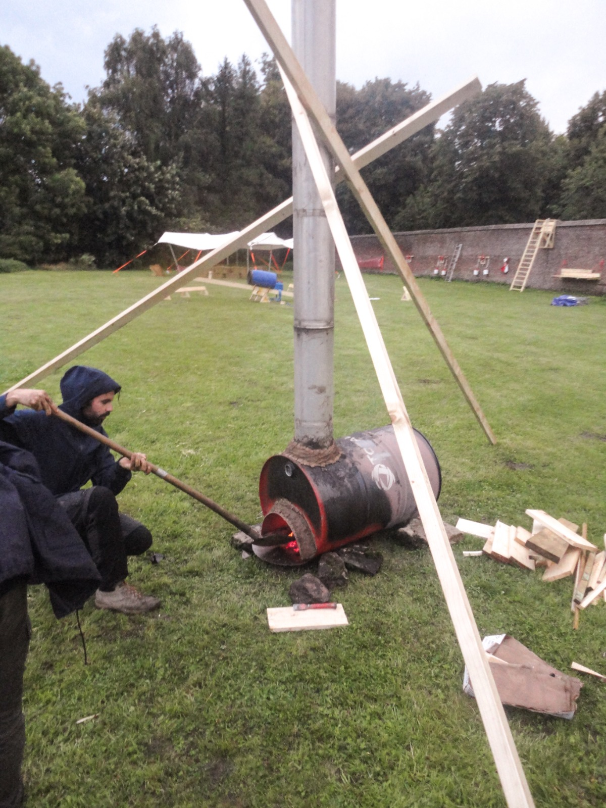
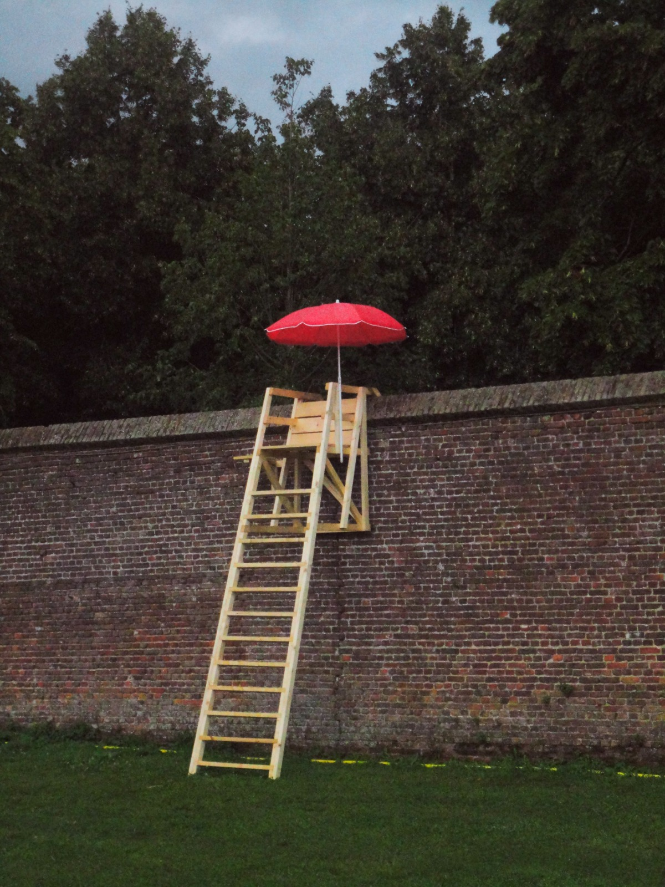
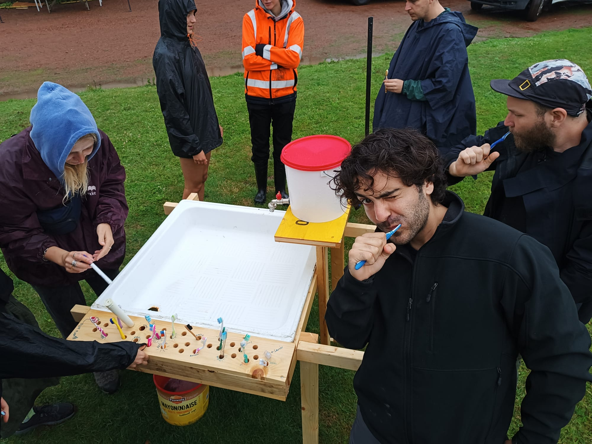
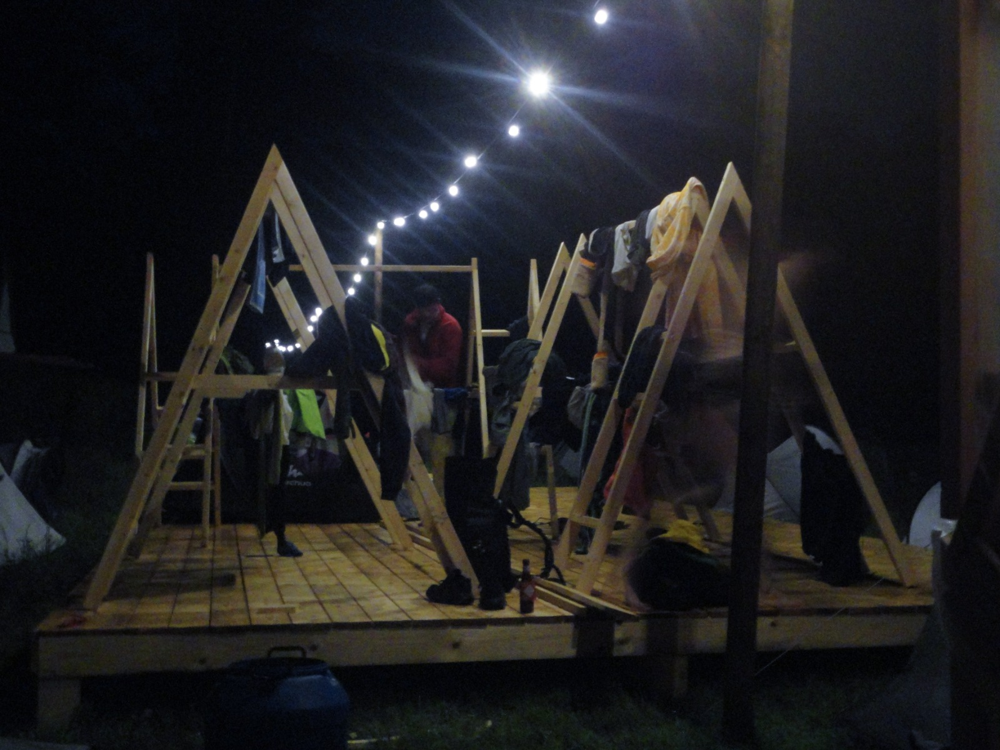
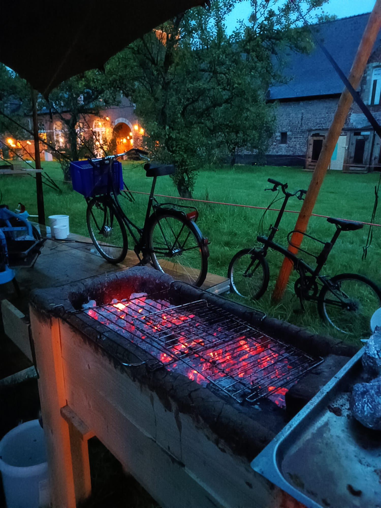
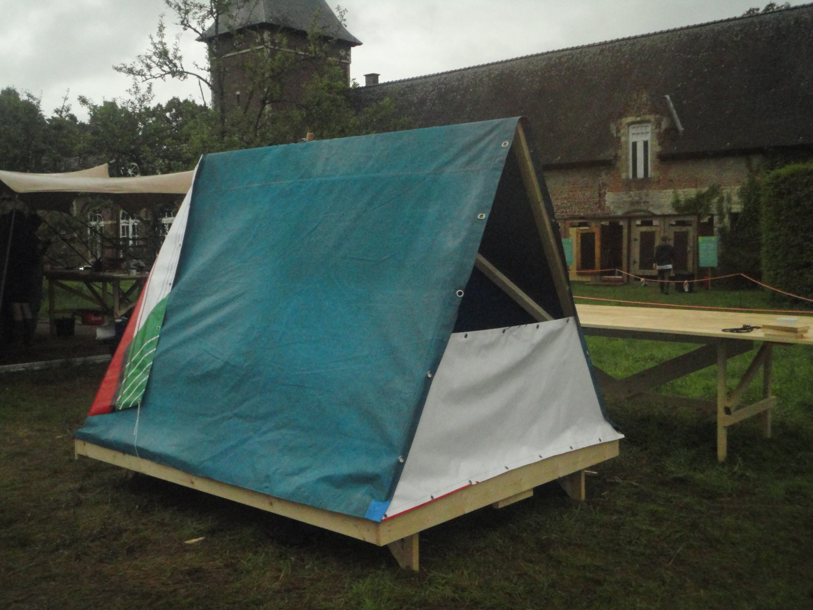
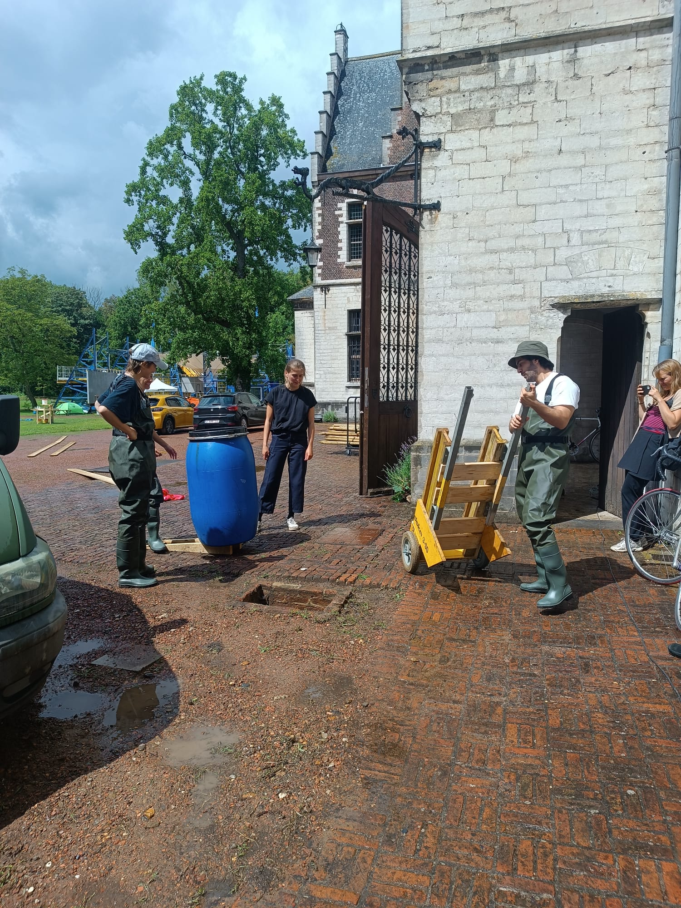
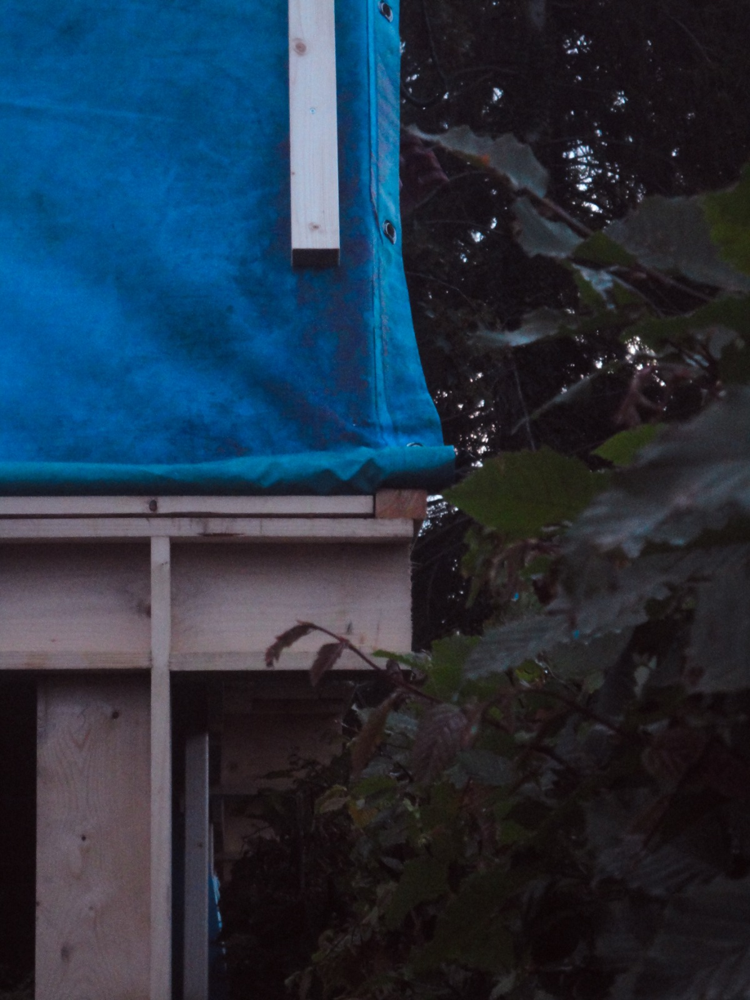
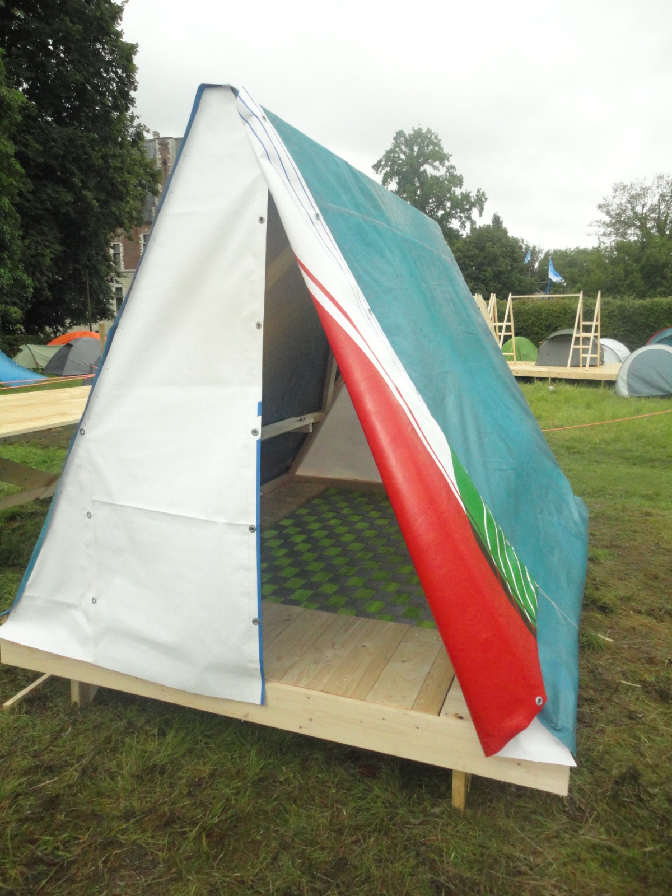
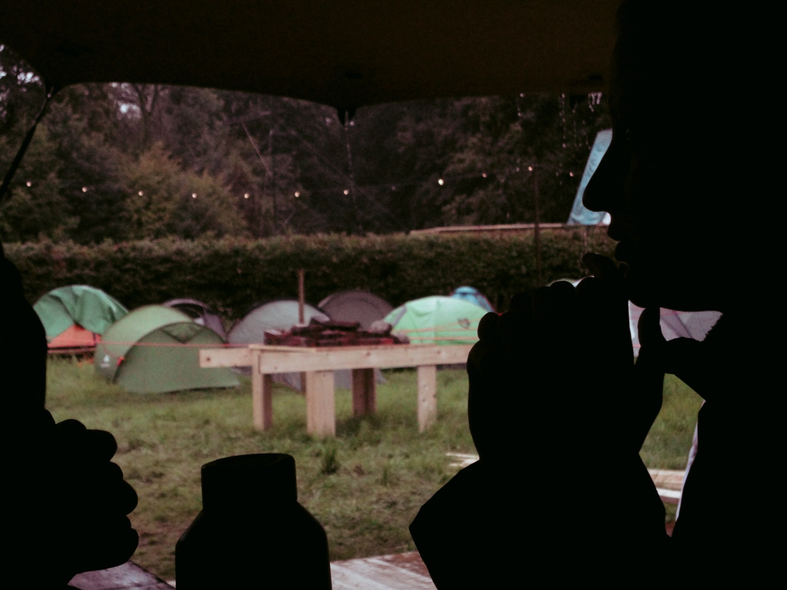
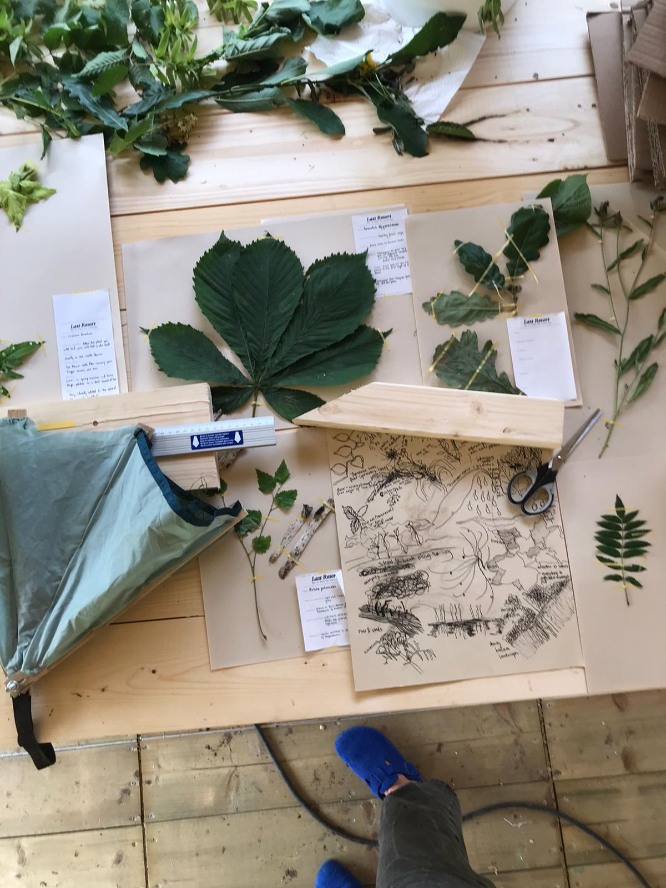

[back](./)

