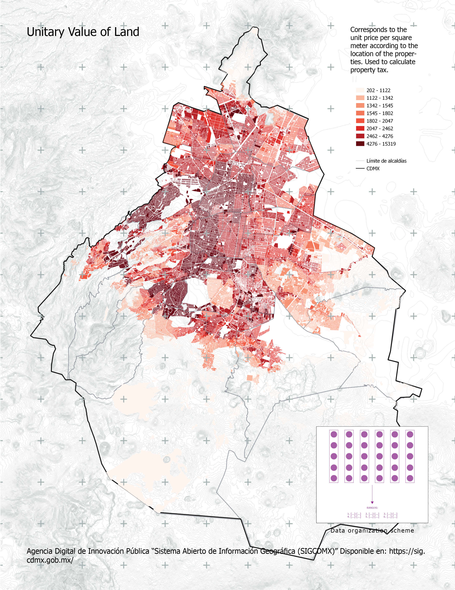
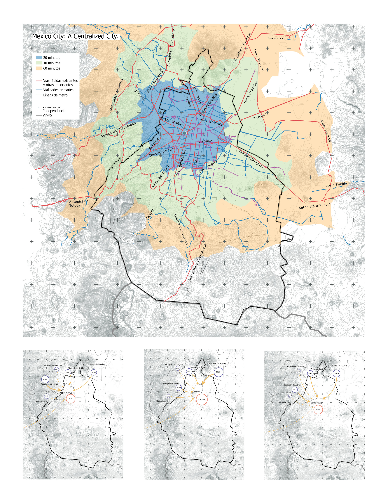

## Post-Covid19 Urban Dynamics in Mexico City | (1/2)
###### _Personal project, 2020_

By leveraging mixed-use zoning regulations in areas adjacent to the city’s economic corridors, the study proposes retrofitting underutilized office spaces into compact, habitable units.

This approach not only repurposes vacant real estate but also redefines accessibility to urban housing, fostering a more adaptive, inclusive, and economically viable model of co-living.

Specifically, it addresses the needs of individuals who commute from the periphery but seek a short-term residence in the city center during their in-office workdays.

[back](./)
