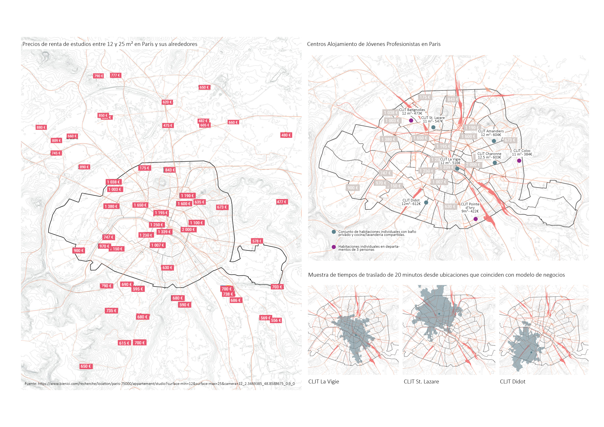

## Follow-up Research: CLJT Housing Typology | (2/2)
###### _Personal project, 2022_

Over the course of a year, while navigating my professional responsibilities, adapting to a new culture, and building a social network abroad, I had the opportunity to experience firsthand the Centre du Logement des Jeunes Travailleurs, Etudiants et Stagiaires (CLJT)—a social housing model that provides affordable rental units for young professionals, students, and apprentices in the heart of Paris.

By providing an accessible first step toward independent living, CLJT represents a progressive urban housing strategy—one that rethinks inclusion, affordability, and social mobility in one of the world's most dynamic metropolitan centers.

Beyond affordability, the model proves viable and sustainable due to its strong infrastructure connections—residences are strategically located near public transportation, educational institutions, and economic hubs, enabling seamless integration into professional life.

[back](./)
