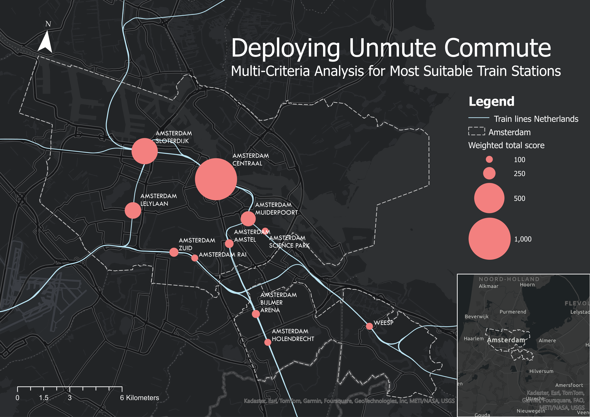
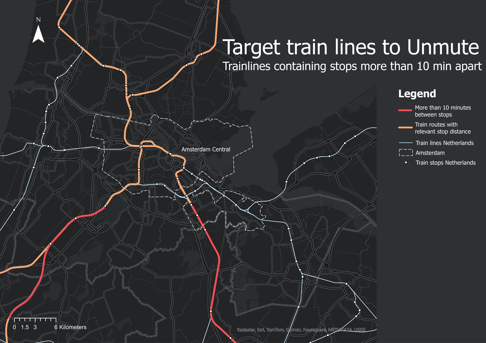
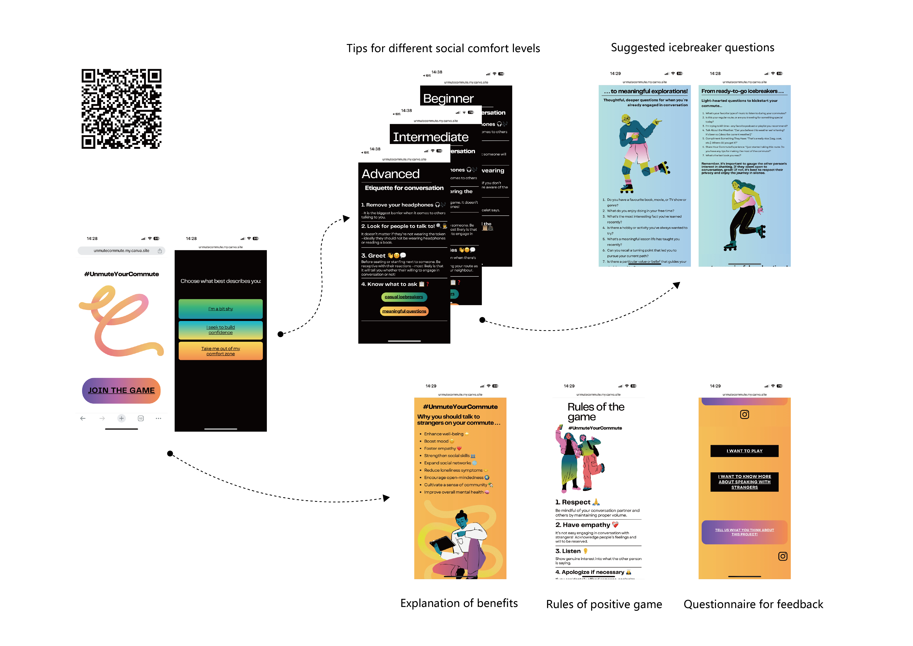
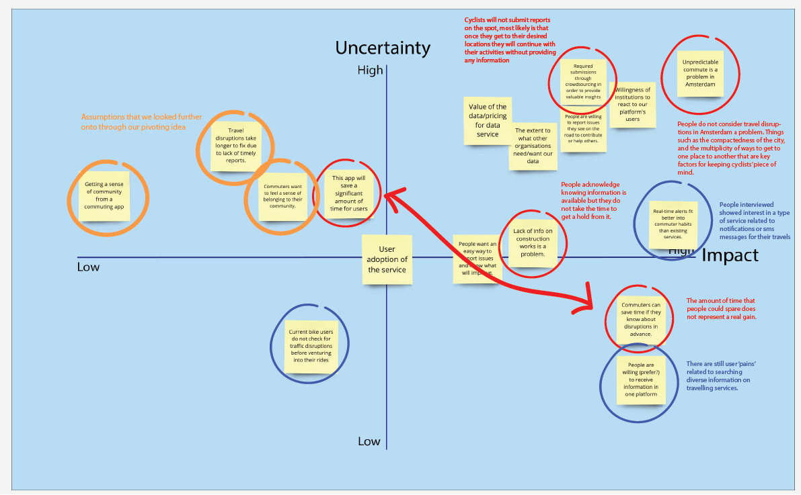
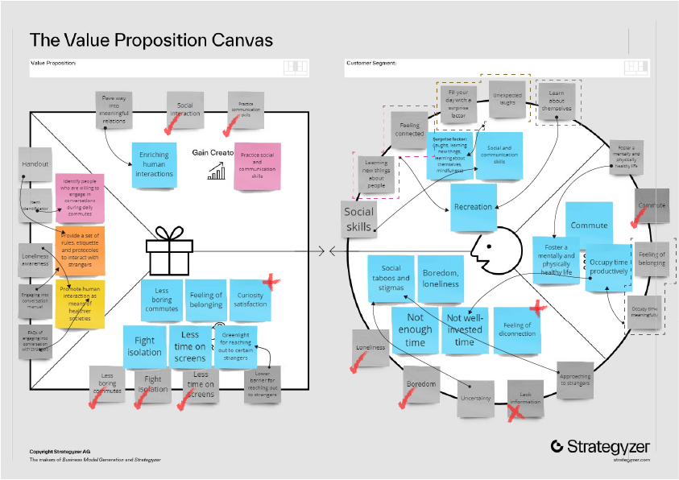
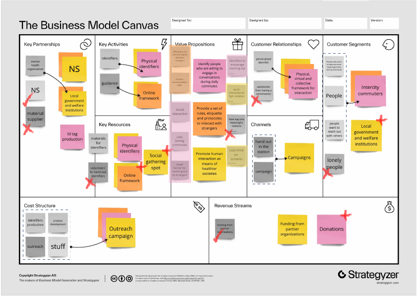

# UnmuteCommute
###### _Joint course project_
###### _Metropolitan Data 2 & Entrepreneurial Skills_

Unmute Commute explores mobility, social interaction, and behavioral change from an entrepreneurial and data-driven perspective. 

It leverages GIS analysis to identify high-potential commuter hubs, balancing scientific research, urban mobility studies, and marketing tactics to craft a scalable, human-centered product.

The product was tested through small-scale trials, GIS-based location analysis, and structured interviews, refining the design, functionality, and marketing strategy before a broader rollout.

Explore the [online toolkit](https://unmutecommute.my.canva.site/unmutecommute) to #unmuteyourcommute 

Through an iterative entrepreneurial process, the project evolved from a disruption alert system to a human-centered intervention that transforms transit waiting time into a moment for meaningful interaction. 

[back](./)
