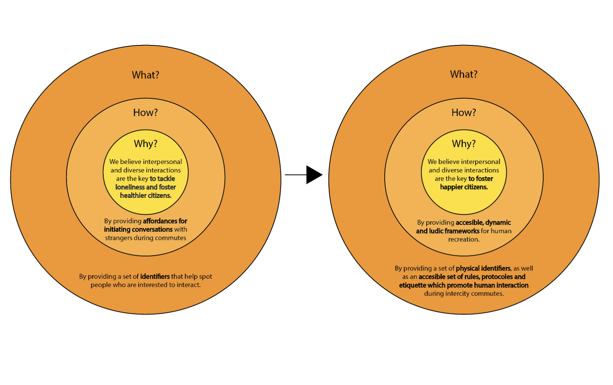
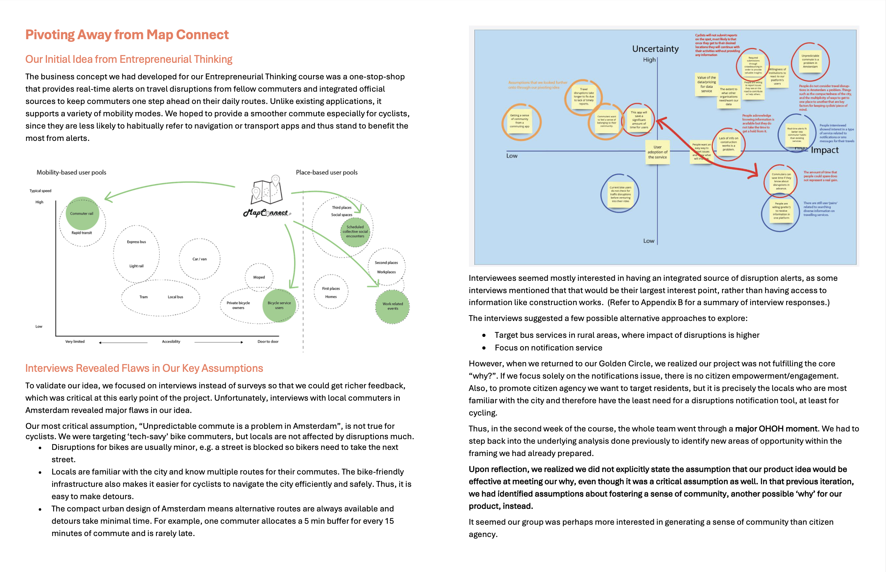
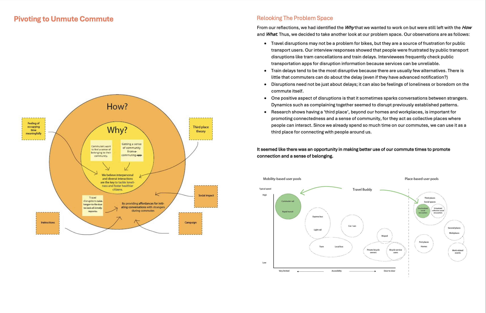
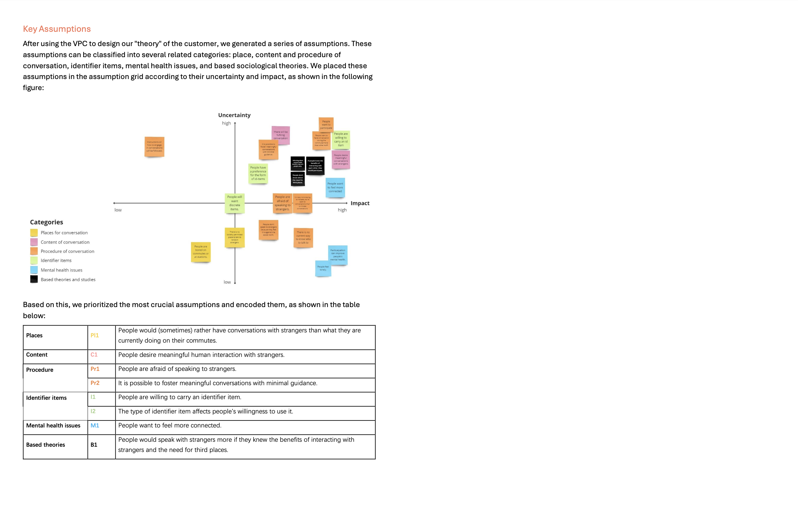
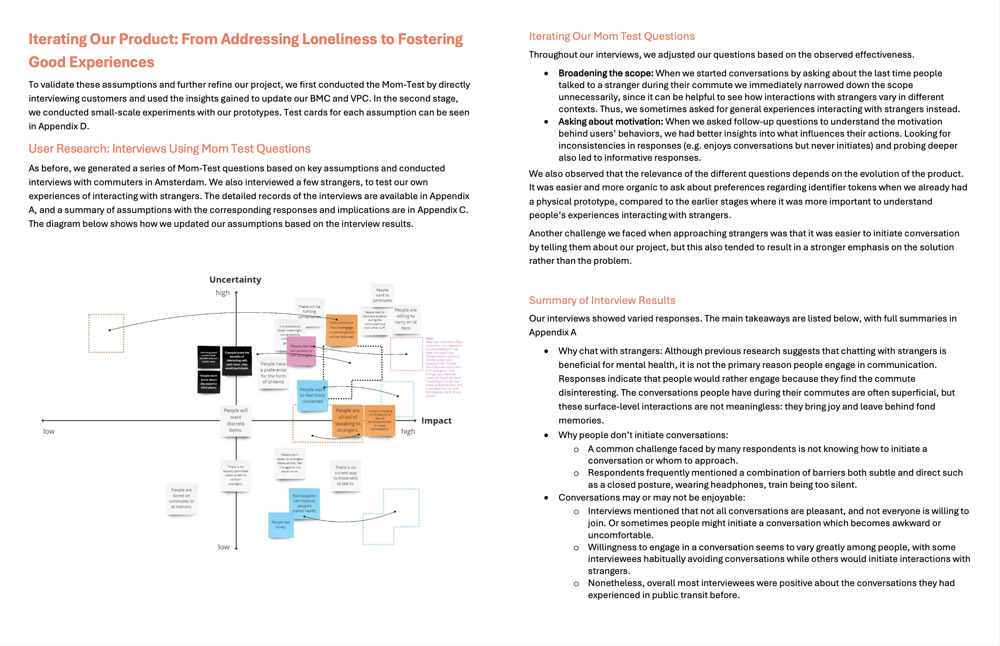
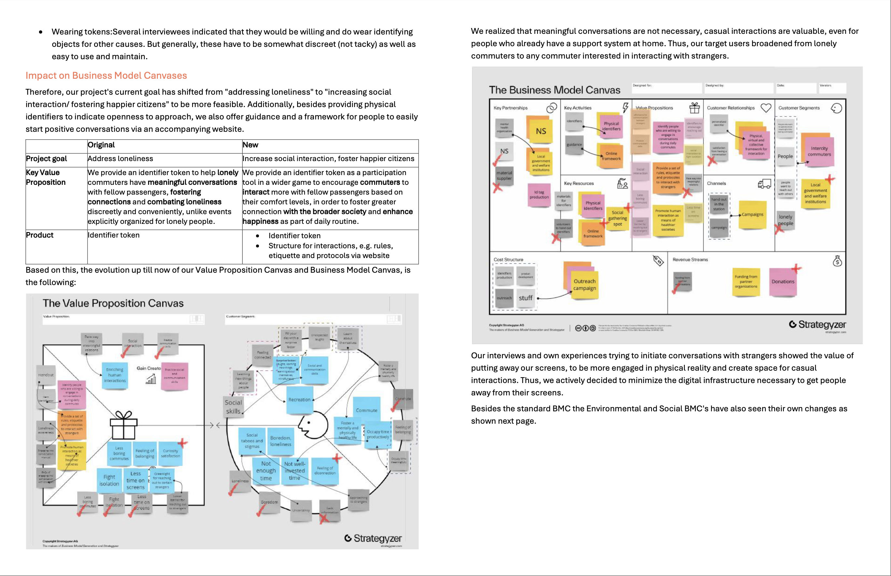

# UnmuteCommute: Designing Social Infrastructure for Commuters

A four-week entrepreneurial sprint that demonstrates how constraint-based iteration refines problem definition. Initial user research disproved the core assumption (travel disruptions as a problem for cyclists), forcing a methodological pivot: redefine the constraint, rebuild the hypothesis, and validate through rapid prototyping. 

As a result, a fundamentally different product emerged. It was grounded in 11 user interviews, iterative feedback loops, and GIS-informed market selection. 

The project illustrates the transition from assumption-driven design to constraint-driven strategy, ending with a validated product ready for deployment at Amsterdam Central Station.

### 1: Problem Identification & Pivot

Initial research on travel disruptions for cyclists revealed flawed assumptions, forcing a fundamental rethinking of both the problem and the solution. Ovreall, interviews showed that Amsterdam cyclists rarely face meaningful disruptions, shifting focus from a logistics problem to a social one.

### 2: Reframing as Opportunity

By redefining "disruption" as an opportunity for human connection rather than a problem to solve, the team shifted from addressing citizen agency to building community through conversation. This highlighted how the monotony of commutes, not chaos, was the actual problem worth solving.

### 3: Product Iteration & Validation

Through iterative Mom-Test interviews and rapid prototyping, the team learned that casual interactions matter as much as meaningful conversations, and that a discrete, easy-to-wear identifier could lower the threshold for strangers to connect. A token was developed as the Minimum Viable Product (MVP) in order to put the idea into action. 

### 4: Market Strategy & Implementation

#### Token (MVP)
The development og the MVP sparked hinderances during the user journey. Consequently, an [online toolkit](https://unmutecommute.my.canva.site/unmutecommute) was developed as an digital complement of the MVP to unmute people's commute.

GIS analysis identified Amsterdam Central Station as the optimal launch location, supported by a targeted billboard campaign designed to reach commuters with adequate travel time for meaningful interactions. Site selection was based on data-driven input, such as passenger flow, disruption frequency, and existing loneliness levels.

### 5: Long-Term Vision

The project roadmap extends from an MVP launch at Central Station toward a broader "Unmute Daily Life" platform that applies the same connection-enabling principles across multiple life contexts.

> 
> 
> 

[back](./)
