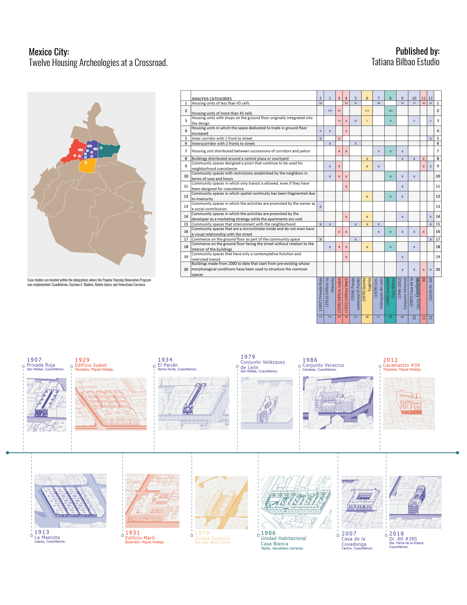
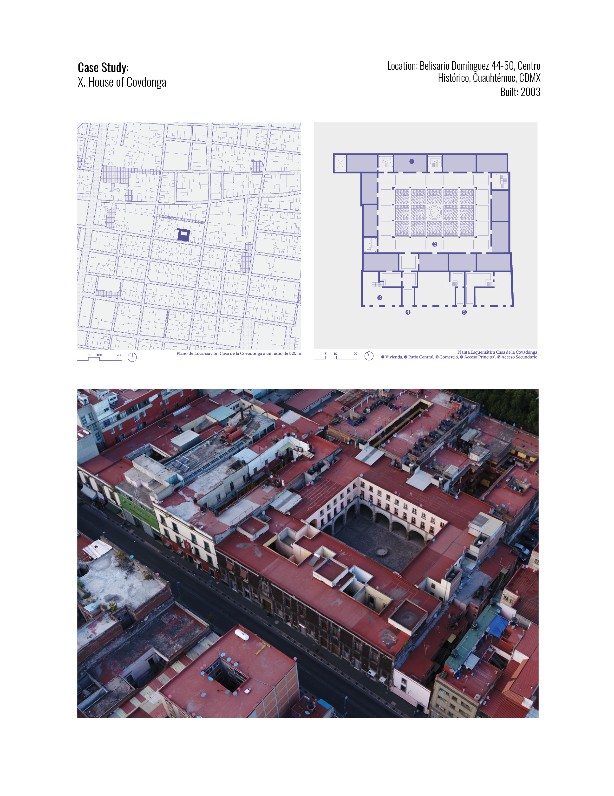
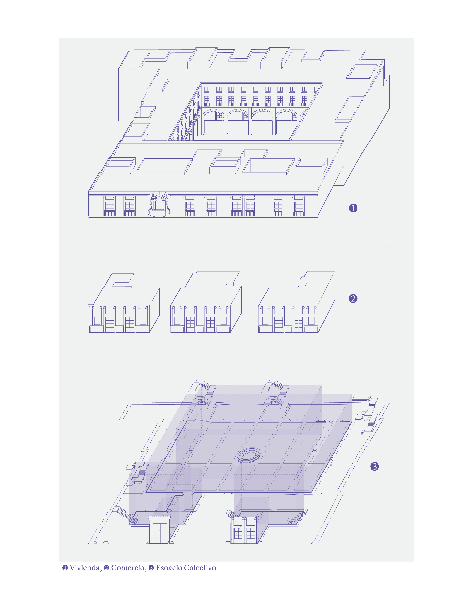
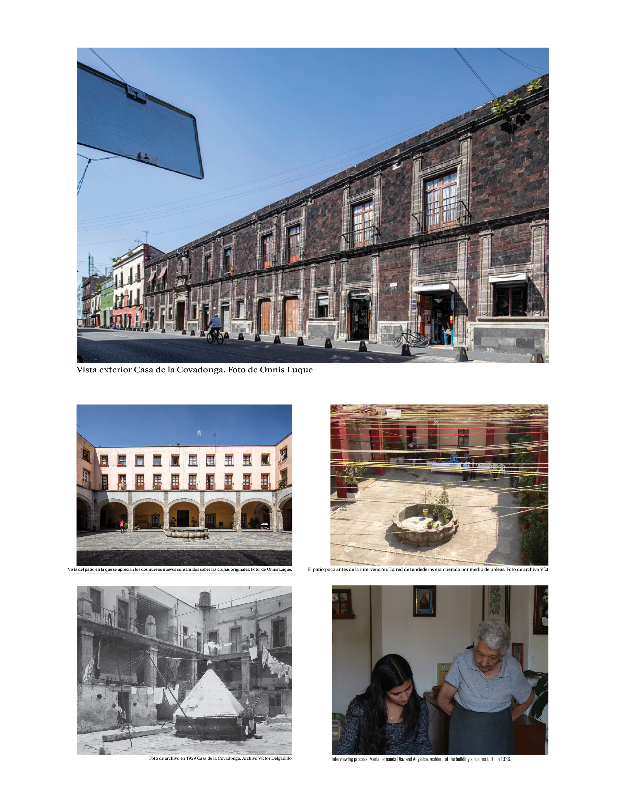

### Mexico City: Twelve archeologies of housing at a crossroads
#### Tatiana Bilbao Estudio 
###### _Social Service_

The main objective is to explore how architecture and the design of collective spaces can foster more equitable and sustainable social relationships, free from the commercialization and legal control that typically govern urban life. The study aims to demonstrate that these spaces can serve as platforms to redefine coexistence and challenge traditional social and economic structures, promoting fairer and more accessible housing models that integrate community and environmental needs.

This case study focuses on Casa de la Covadonga, a historic building in Mexico City's Centro Histórico, and its transformation through a government-led social housing program. It provides insight into the broader urban renewal strategies applied in the late 20th and early 21st centuries and the challenges of balancing historic preservation, social housing, and gentrification.

Nuestra Señora de la Covadonga was a voluntary refuge for destitute Spanish women, where they received Christian education, training in handicrafts, reading, writing, and basic arithmetic.
In 1930, it was declared a historical monument. The foundation owned it until the year 2000, when it was expropriated by the INVI (Instituto de Vivienda del Distrito Federal) for its restoration and recovery.

[back](./)
