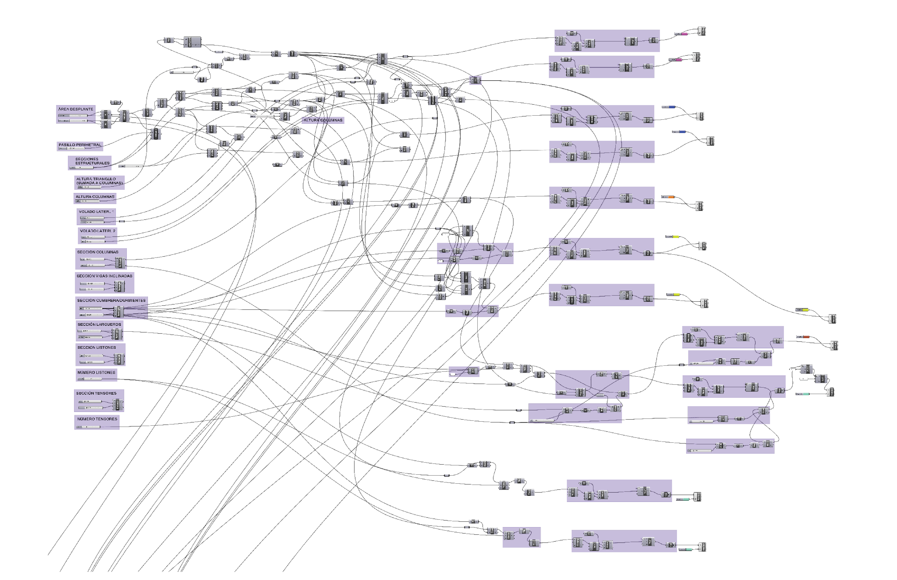
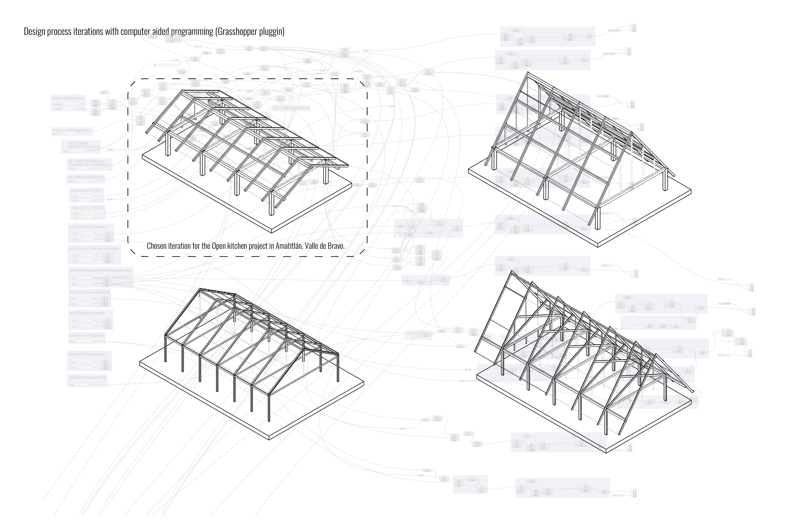
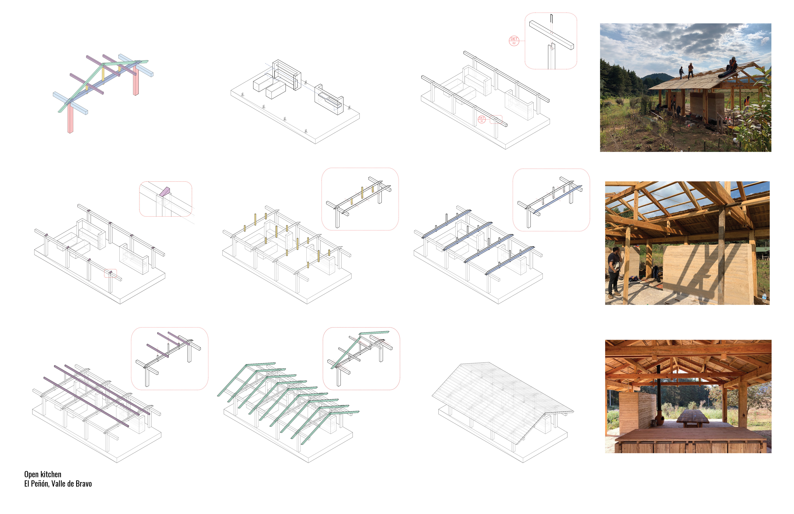
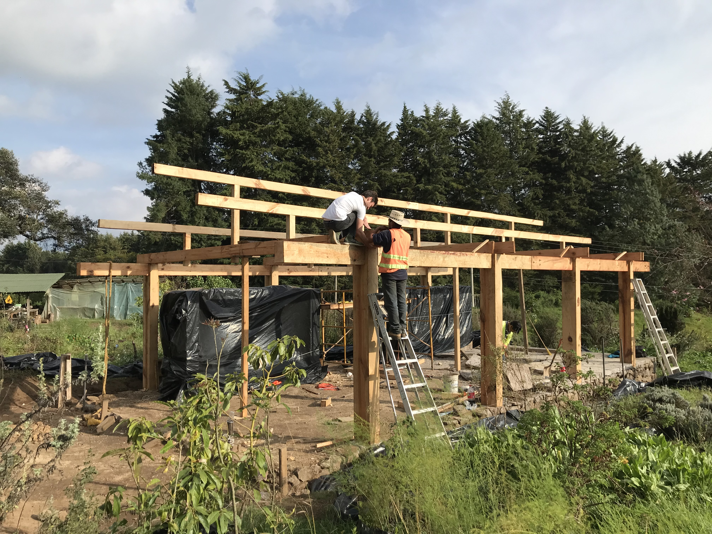
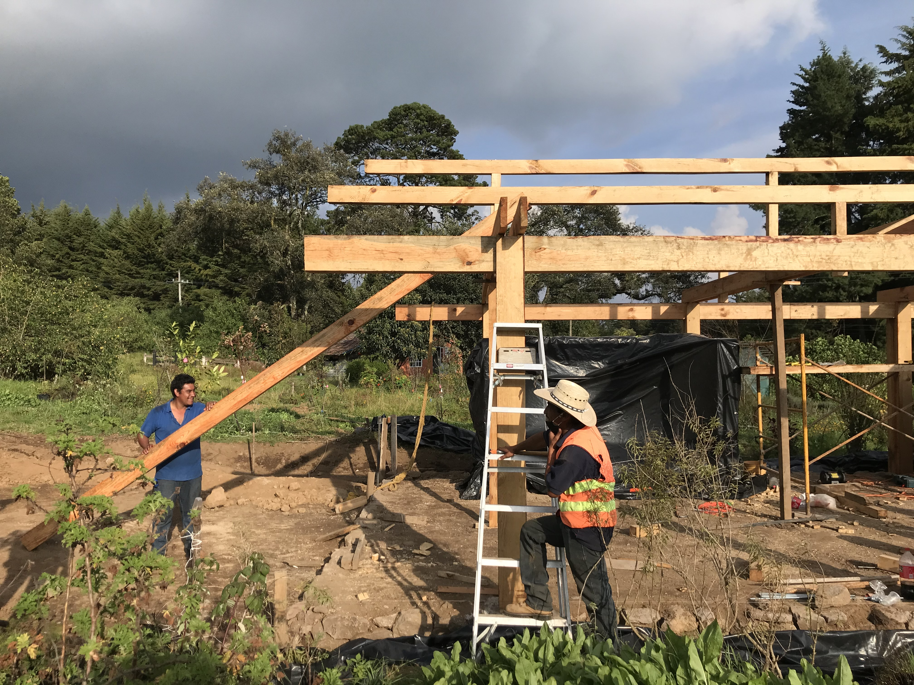
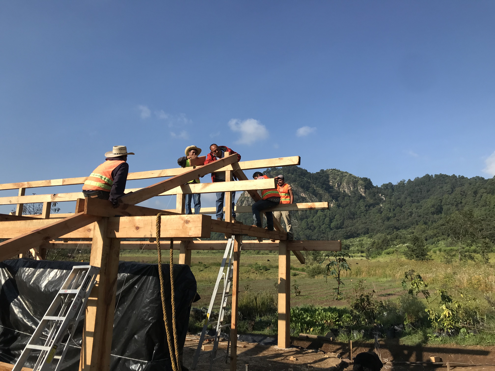
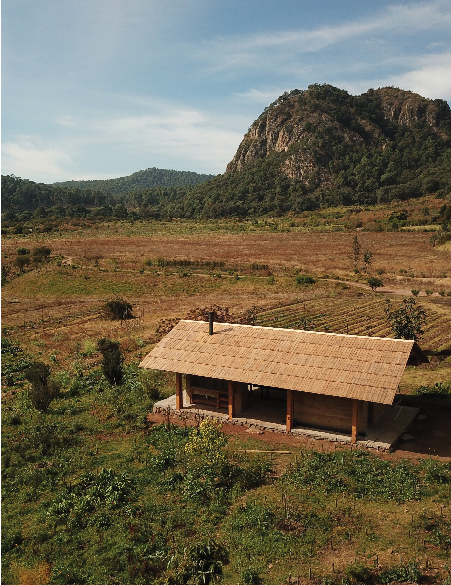

### Wood Prototyping, Fabrication, & Community Engagement
#### Taller Casa-Estudio 

Timber construction in Mexico sits at a difficult intersection: digitally sophisticated design tools on one side, unskilled labor and limited construction literacy on the other. This project worked inside that gap.

Working within a parametric design framework, the project developed an iterative digital definition that allowed multiple structural and aesthetic configurations to be evaluated against feasibility constraints and presented directly to the client. The definition functioned as a shared decision-making tool.

###### Grasshopper definition

###### Iteration overview

###### Development of selected iteration

The second challenge was translation. Once a configuration was selected, the process required producing construction documentation legible to builders without technical training. Through clear sequencing, visual instructions, and a common material language, the documentation made the fabrication process accessible without simplifying the design intent.

The result was a built structure that moved from parametric model to physical assembly through a deliberate chain of communication between designer, client, and maker.

###### Construction process

>   

[back](./)
