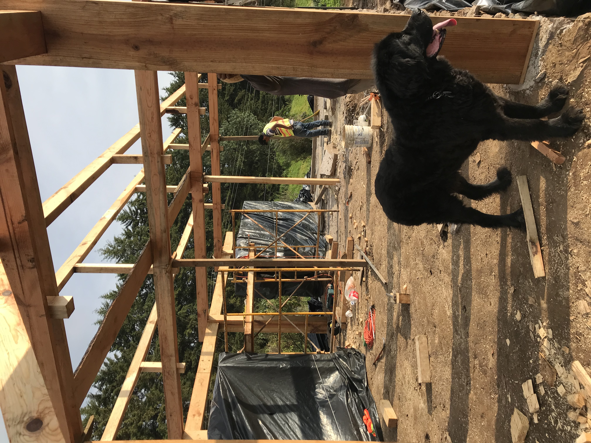

### Wood Prototyping, Fabrication, & Community Engagement
#### Taller Casa-Estudio 

The research process required a strict building criteria set onto digital parameters to later generate an extensive database where different iterations of the same principles coudl be presented to the client and be evaluated on feasibility and aesthetics.

Through construction instructions, the aim is to make the construction process accessible and efficient, as well as to establish a dialogue that uses a common language

[back](./)
