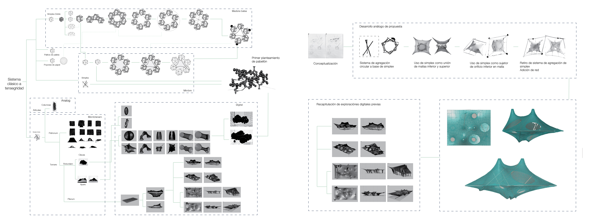
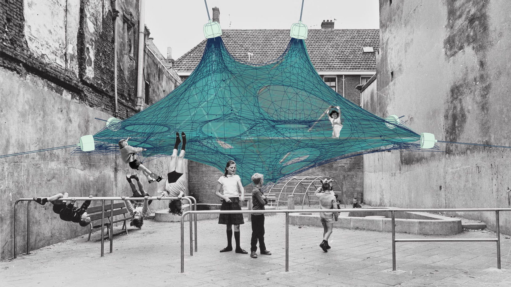
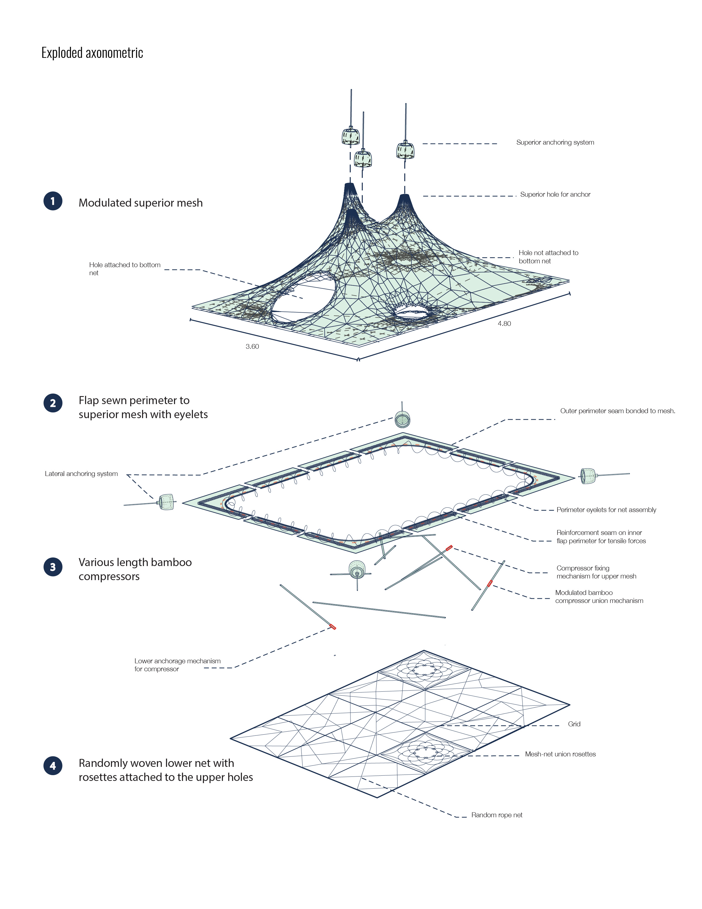
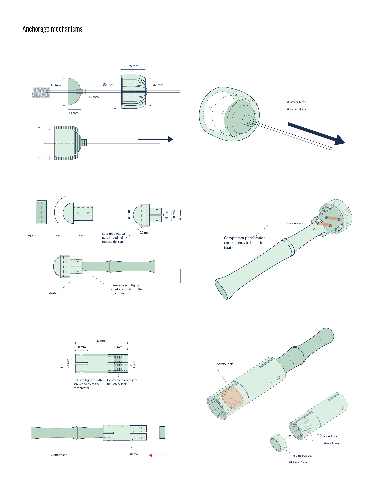
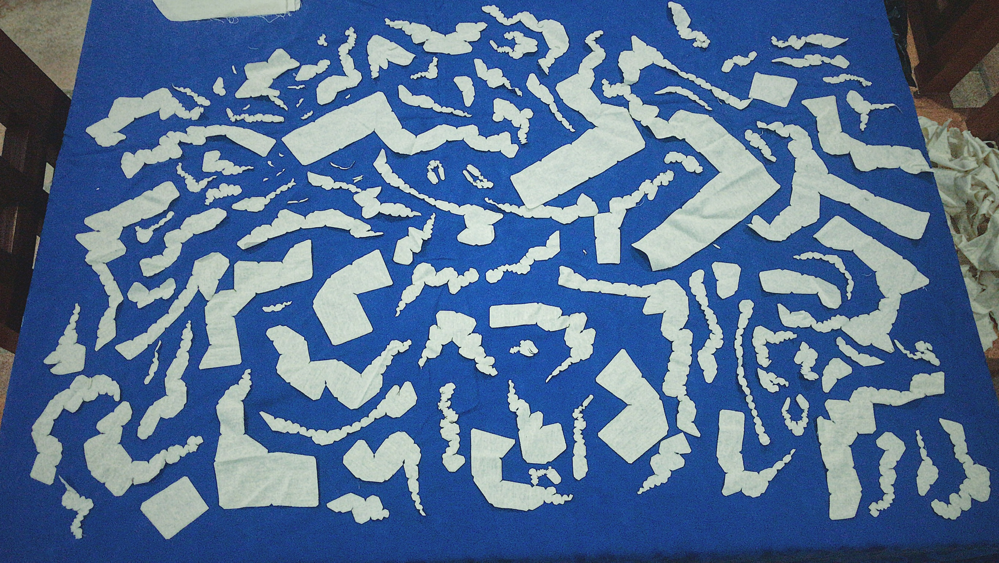
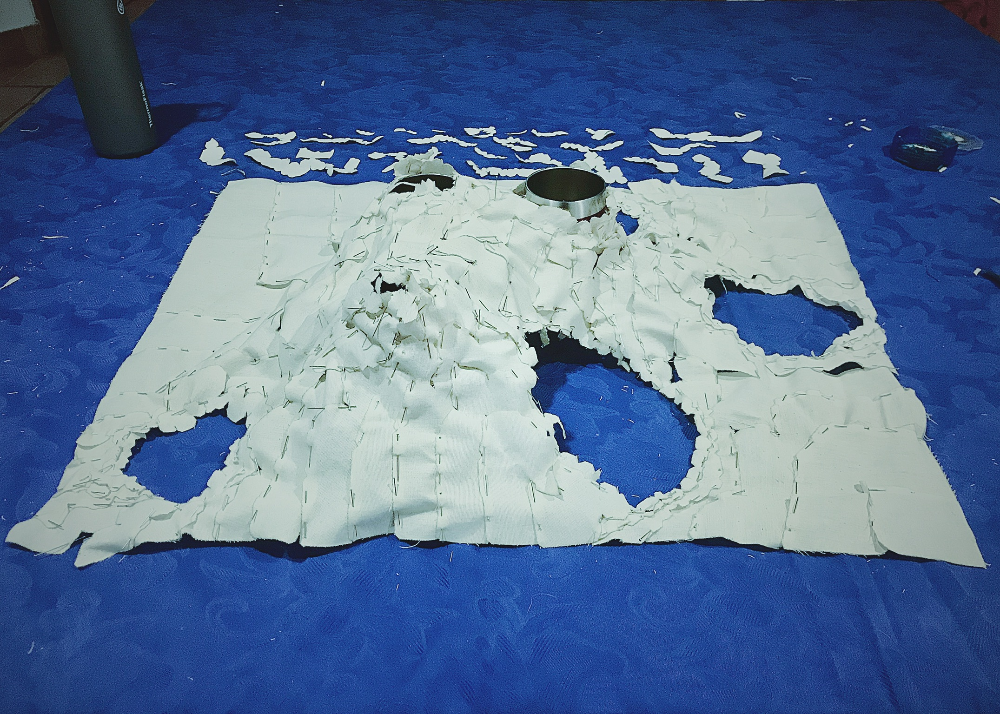

### Tensegrity Pavilion 
#### Digital Prototyping & Experimental Research
###### _Graduation Project_

This investigation demonstrated the power of a non-linear research approach that embraces the interplay between digital and physical realms.

The inherent instability and interconnectedness of tensegrity structures provide a unique framework for children to engage in dynamic play experiences, challenging their spatial awareness and problem-solving abilities.

#### Prototyping

[back](./)
