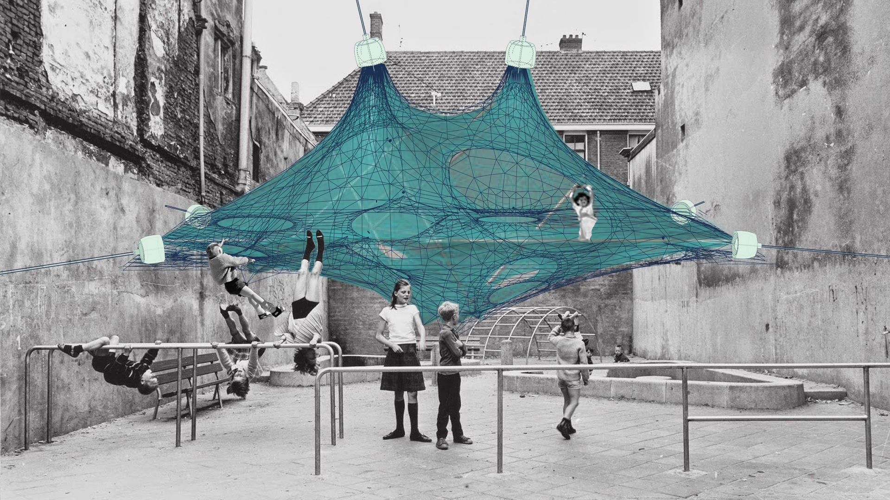
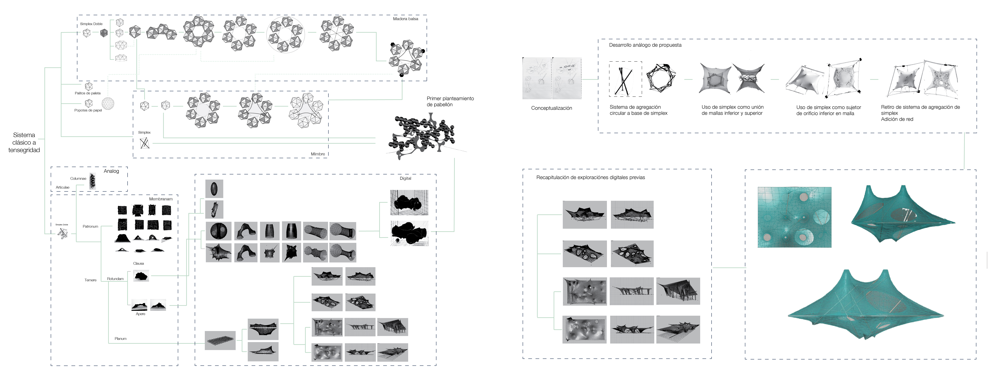
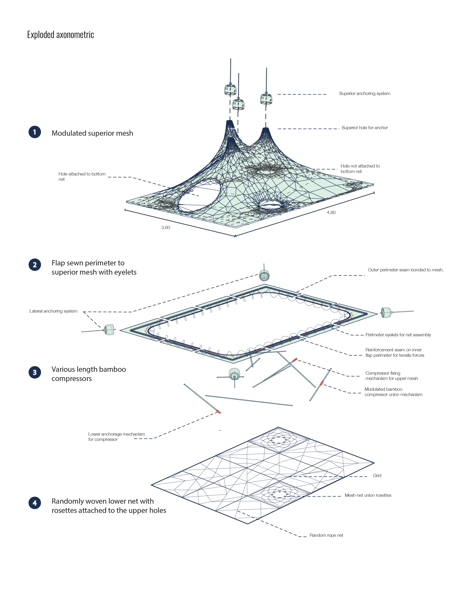
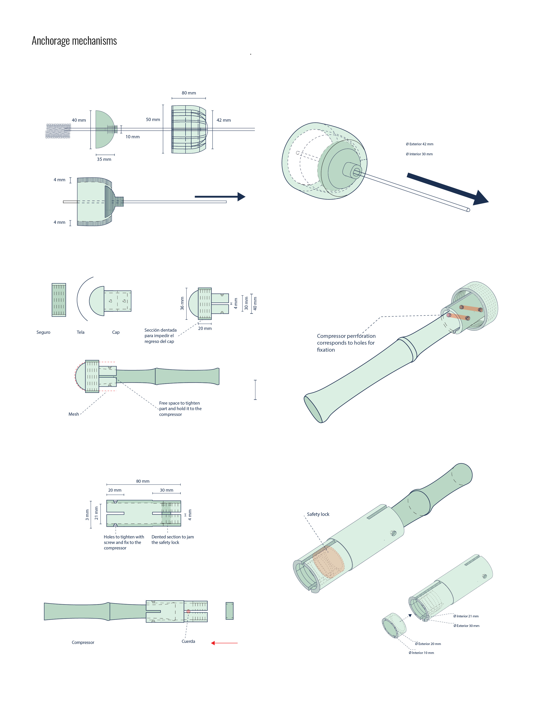
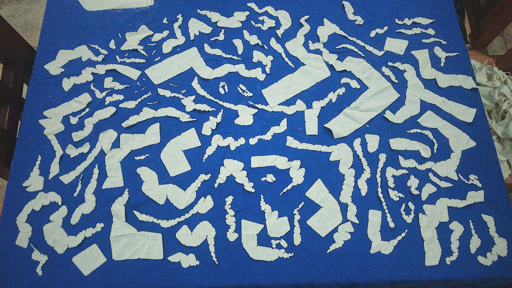
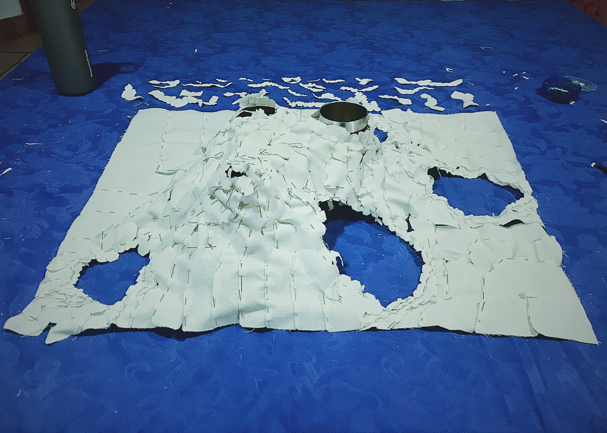
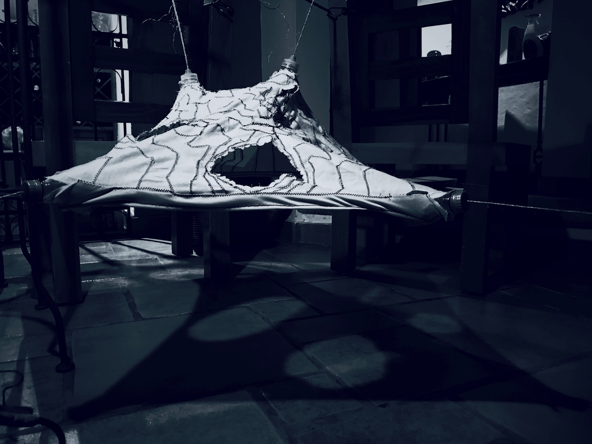

### Tensegrity Pavilion 
#### Digital Prototyping & Experimental Research
#### Graduation Project
###### _Taller de Producción Digital y Proyecto 1 & 2_

Tensegrity structures hold themselves together through a precise balance of continuous tension and discontinuous compression. There is no redundancy as every element is load-bearing and every connection is critical. This makes them structurally efficient and inherently unstable.

This graduation project used tensegrity as both a structural system and a research framework. Working non-linearly between digital simulation and physical prototyping, the investigation mapped how variations in geometry, material, and connection logic produced radically different structural behaviours. Each prototype was not a failed or successful attempt — it was data.

A phylogenetic tree of structural iterations documented the evolution of the system, tracing formal and behavioural lineages across over a dozen physical models. The digital definition allowed variables to be isolated and tested independently before committing to fabrication.

The final proposal applied tensegrity's spatial qualities — dynamic, responsive, inhabitable instability — to a pavilion designed for children's play, where the structure's inherent unpredictability becomes the experience rather than a problem to be solved.

The project demonstrated that non-linear research, when properly documented, produces a richer understanding of a structural system than any linear process could — because the failures are part of the argument.

#### Prototyping

[back](./)
